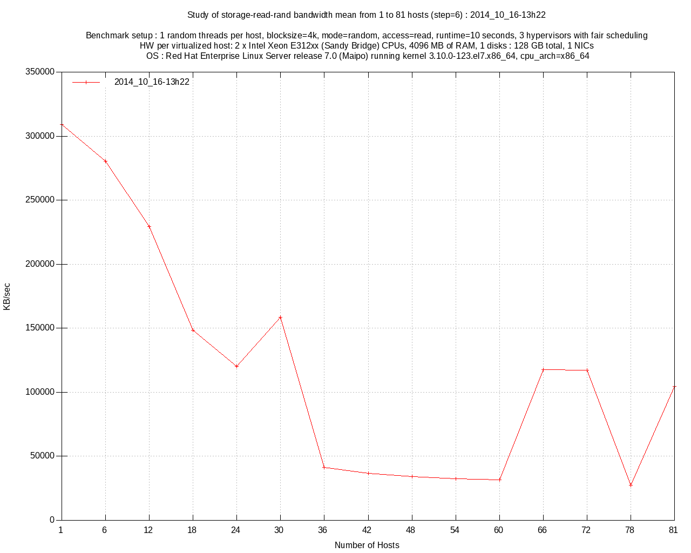
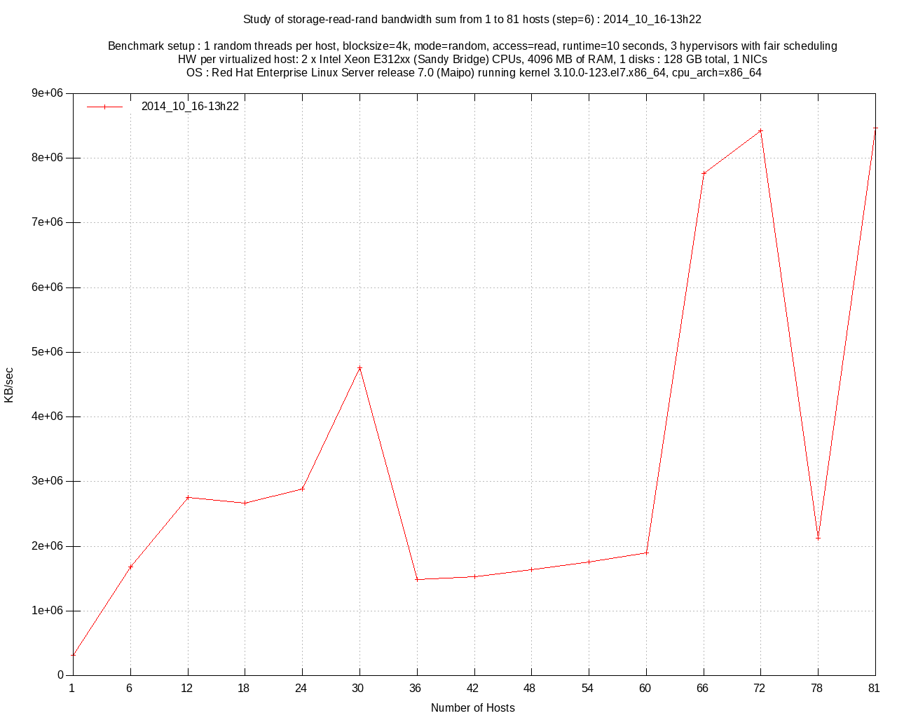
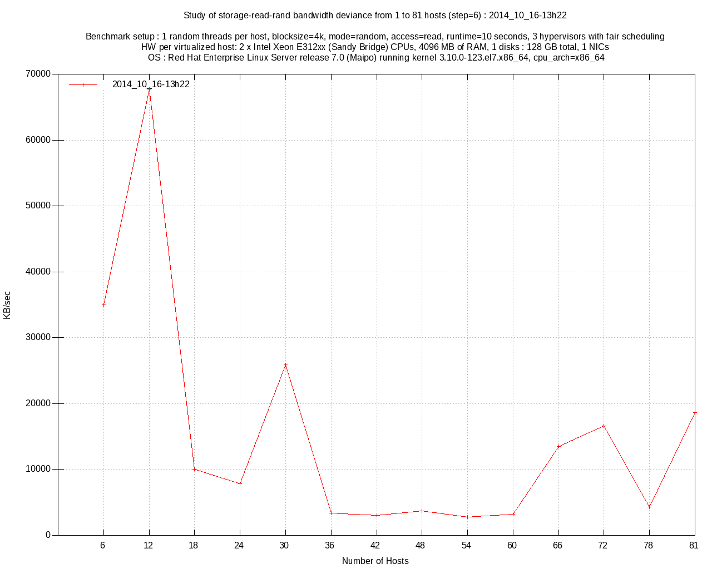
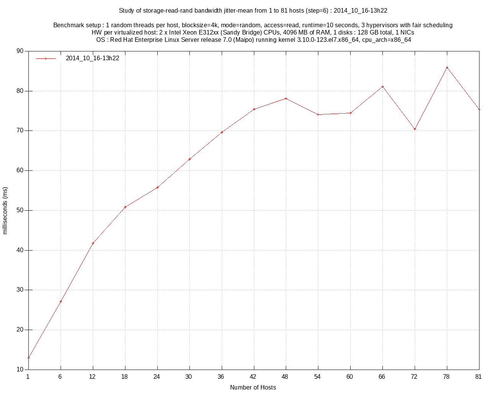
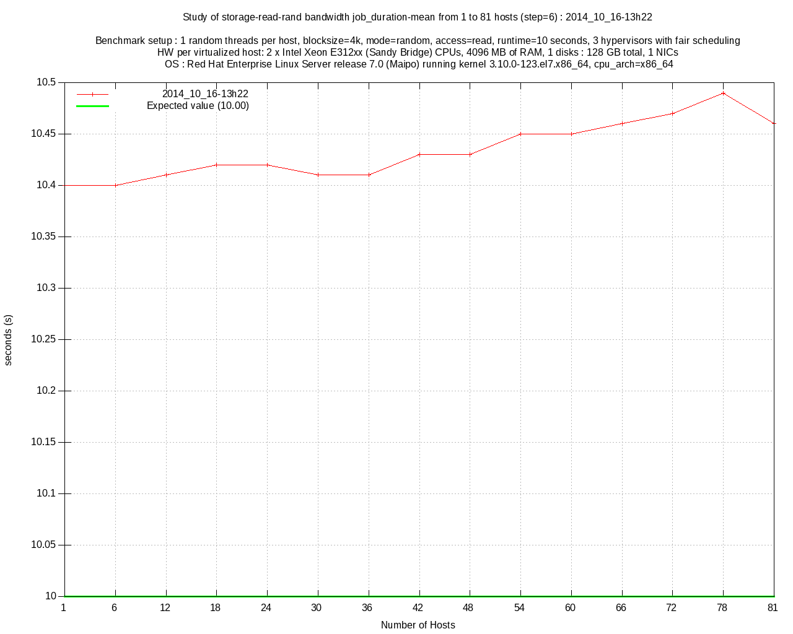
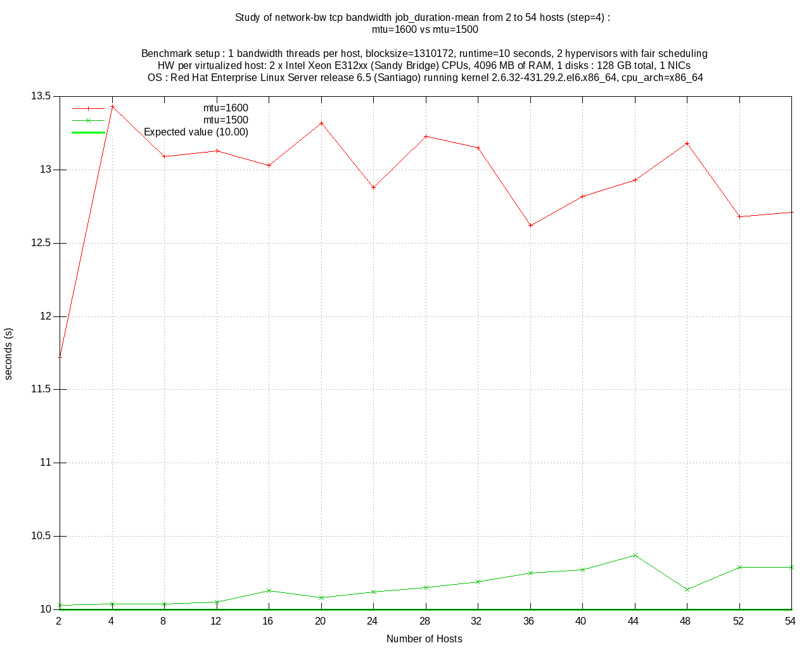

=========================================
Automatic Health Check (AHC) - User Guide
=========================================

--------------------------------------
Benchmarking infrastructures made easy
--------------------------------------

.. contents:: Table of Contents

Introduction on the need of benchmarking infrastructures
========================================================
An infrastructure s made of physical servers, networking components and some software, 
and is made for delivering a service. Once the first step of racking, connecting everything is done,

it's time to ask yourself those questions : 

- "Are all my servers performing as expected ?" 
- "Is the level of performance the expected one ?”

If you bought those servers together, the usual answer is: 

- "Yes, they are supposed to be and perform the same"
  
Is it enough to get into production ? What would be the consequences of a mostly-failing component on the global infrastructure ?

To get a clear view of your infrastructure state, you have to benchmark it.


What AHC is made for ?
======================

AHC is made for answering this simple question:

- "Are my servers running almost normally ?"


The *almost* part of the sentence is very important. This tool does not try to benchmark everything in every possible configuration  but make a best-effort estimation of your server’s capabilities.
Having a quick overview of a system to insure the basic features are working well. It’s usually enough to track down weak systems.

AHC's concepts
==============

Reproducibility
---------------
Software configurations/changes is a big concern when performing performance tests. It’s mandatory to reduce any possible source of annoyance that could have a positive or negative impact on the performance (like a crontab, a change in the benchmark tool itself or patch on the Linux Kernel). As we try to setup a performance indicator to compare a set of servers, keeping the same OS over server and time is a key point to consider.

The main idea here is to create a custom operating system that embeds the less amount of possible software with the Linux distribution of your choice. Ideally, the result is a bootable disk image or a kernel and ramfs files that could be booted over PXE.

The main benefit of this approach is being able to boot anytime your servers in order to run a benchmark test series without making any change on your production environment.

As a result, the performance metrics will always be provided on the same software environment letting as a unique difference between tests and over-time the hardware you have. It’s so possible to perform some differential analysis between install time anytime later if some issues are occurring on this particular server. This also could be used to ensure that a new server at least as performing as the other servers of a given pool..

AHC is part of the eDeploy project as a role that performs the task of selecting the main packages required to perform all this benchmark series. The resulting Operating System is now strongly versioned, archivable and available at any time. Booting becomes very easy by using a USB key on standalone servers or via PXE on an already setup network. 

Be as close as possible to the hardware
---------------------------------------
Benchmarking an infrastructure means being able to define how every single component (cpu, ram, storage, network) performs. To understand every single defect, it's important to be as close as possible to the hardware. This does have an impact on the tool to select and the associated parameters.

What we don't want to benchmark :

- caching effects

  The memory is usually used on every system to speed-up the access time to a given resource. Using memory turns milliseconds or even seconds to reach an information into {micro|nano}seconds.
  It will be so mandatory to ask tools to avoid explicit caching.
- software optimization to hide hardware defects

  To optimize the usage of a resource, operating systems are providing software layers to optimize the access to the resource by aggregating requests or rescheduling IOs.
  Filesystems are known to do this kind of work. As we want to measure the state of every single device of the infrastructure, testing it through a filesystem hides part of the reality of this device.
  Storage benchmarking will have so to test the block device directly instead.


Constant time benchmarking
--------------------------
It’s a common mistake to use tools that try to see how long it takes to process a given amount of data. Benchmark results are usually expressed in ‘unit per time‘ like Megabytes per seconds, Gigabit per seconds. If time is not a fixed element, the benchmark aren’t really comparable : processing 1GB of data on a system that consumes them at 100MB/sec last 10 seconds while it will take 100 seconds on another that performs at 10MB/sec.

Comparing both results when comparing a 10sec run versus a 100sec run. This huge difference of running time can hide or reveal various unexpected events like a crontab running in background. Another annoyance is the unpredictability of the required time to run a particular test on a set of non-similar servers.

Fixing the time for a test answer the question "How much data can I process in this amount of time ?" instead of "How much time do I need to process this amount of data ?"

The benchmarking tools have to support time-based benchmarks.


Do no trust humans
------------------
Automation is a key element on the success of a good benchmark suite. Benchmark tools are usually offering various options and usage.
Selecting or missing a particular option could totally change the meaning of a test.

In some storage testing tools, if you forget to disable the use of the Linux cache, you have a great chance of testing more your memory than your disk.
If you are not aware of this behavior or if you missed the setting, the interpretation of results could be very misleading.

Humans are weak machines, even if you read something wrong, your brain with make you read what you expected to read more than the mistake.

A great example of this effect is shown in the following images:


To avoid any human mistake, having a tool that runs automatically a set of defined commands is an important protection against any misuse of tools leading to wrong results.


Kill any source of doubts on software
-------------------------------------
Mastering your software configuration is required to get consistency over time and systems. Trying to estimate the performance of a given hardware requires the benchmark tool to be the sole one using a particular resource. The more processes will use this resource at the same time as the benchmark the less reliable will be the result. 

It’s pretty obvious that performing some rsync/logrotate/database IOs while trying to estimate disk’s performance isn’t a good way to get a coherent result. Those example are pretty obvious, but at the time you run your benchmark, it could be a pretty complicated being 100% sure that not a single non-expected task ran. On an infrastructure which is in production, this could turn into a complex task disabling all possible sources of annoyance.

The way to go is embedding all required tools and automation scripts into your own live operating system. The easiest way to get a clean operating system for a benchmark, is to generate one with the minimum dependencies. It’s almost like creating a minimal system (like debootstrap on debian), install the benchmarking tools you need, no graphic server and for sure, no crontab at all. Once this minimal system is setup, create a ramfs with it and boot on it with your favourite bootloader (pxelinux, extlinux, grub, …). This steps are done automatically by eDeploy.

Having an under-control operating system that will be the same over servers and time remove any possible doubt of a background process running at the same time as your benchmark. It become possible running the benchmark in a controlled fashion on an already installed server. If you have any doubt of a particular hardware, reboot the server in this under-control operating system, perform the benchmark and voilà.


Results should not be stored without context
--------------------------------------------
Keeping the hardware description/configuration attached to your performance results is an efficient way to “remember” what was the context. It could be used to determine that a particular under-performance could be linked to a hardware change or configuration.

The more details about your hardware you have, the easier it will be to determine the link between a change and a performance issue/increase.


Tools used in AHC
=================

CPU & Memory Benchmarking
-------------------------
The Sysbench project offer a single interface to compute both CPU computing power and memory bandwidth. Its main advantages are a lightweight source code, a GPL licensing, a threading option and a time based mode.

This benchmark does not test all features and instructions the CPU have and this is not the objective to do it neither. Sysbench reports a number that represents a global level of performance. This number doesn’t really have a unit humanly understandable,it is much more like a relative performance indicator.

About the memory module of Sysbench, it performs IOs of a given block size to the main memory. It’s pretty straightforward to understand. The result of this benchmark is a memory bandwidth in MB/sec reported during a constant time.


Storage Benchmarking
--------------------
When thinking about storage benchmarking tools, fio comes immediately in mind. Mainly developed under the GPL license by Jens Axboe (Linux Kernel Maintainer of the Block Layer) , this tool is by far the most versatile tool I’m aware of. As we try to estimate the performance of the hardware by itself, removing the filesystem layer is mandatory.

Filesystems are complex beasts that have various optimization and behaviors that are useful for users but could hide some defects or introduced non desired latencies. The more software on the data path, the more complex is the analysis of the results. Making the same test on two different filesystems would lead to pretty different results. As we want to be as clause a possible to the hardware, it’s important to remove this source of possible annoyance.

Fio’s ability to perform IOs at the block level is a very interesting feature here. Fio can be scripted to perform the exact IO pattern you need while keeping under control the time you spend on your run and ensuring that it runs without any cache Layer from the Linux Kernel (O_DIRECT).


Network Benchmarking
--------------------
The Netperf project, under a BSD-like license, is clearly one of the most known and used tool over the Linux world. It provides a very simple command line, a port based pairing, TCP and UDP support and up to 20 different scenario. This tool is used to report the network bandwidth or latencies that a set of servers can generated simultaneously. The performance is expressed in Gigabit/sec or messages per seconds.


Standalone benchmarking
=======================

Concept
-------
When delivering a new platform, you need to check every single server by its own with the minimum dependencies to start this task. The standalone mode of AHC is made for testing local components (storage, cpu, memory) of a given server. It will inspect them one by one to provide a detailed view of their sanity and the resulting performance.


Building AHC
------------
Building AHC requires using eDeploy and select a particular Linux distribution like Debian|Ubuntu or Redhat|Centos.

A simple command is enough to build it like :

* for debian :

::

 make health-img SERV=<ip_of_http_server>

* for Redhat : 

::

 make health-img SERV=<ip_of_http_server> DVER=RH7.0 DIST=redhat ISO_PATH=<path_to_rhel-server-7.0-x86_64-dvd.iso> RHN_USERNAME='rhn_user@domain.com' RHN_PASSWORD='rhn_password'

This build process generates a bootable disk image like *health-RH7.0-1.6.0.img* but also a kernel and a ramfs named *health.pxe*. It is so possible to boot AHC by using an USB key or PXE.

The SERV= option allow you to define on which server the benchmark results will be uploaded.

Using AHC with an USB key
-------------------------
The USB key is featuring a VFAT partition to save results. After the benchmarking, plugging the USB key back to your computer will expose the files from the VFAT partition.

Using AHC with a PXE booting
----------------------------
When using pxelinux, adding a simple entry in your pxelinux configuration is enough to make your server booting on AHC.

A typical configuration file looks like :

::

 LABEL health
 KERNEL vmlinuz-3.10.0-123.el7.x86_64
 APPEND initrd=health.pxe SERV=192.168.1.1 IP=all:dhcp SESSION=install ONSUCCESS=halt ONFAILURE=reboot


Boot options
------------

===================  ============================================================
Variable Name                         Role
===================  ============================================================
SERV                 IP address of the eDeploy server URL
HTTP_PATH            Path to access the upload.py (HTTP_PATH/upload.py)
HTTP_PORT            HTTP Port to contact the eDeploy server
ONSUCCESS            Action to take upon successful installation (kexec\|reboot\|halt\|console)
ONFAILURE            Action to take upon failed installation (console\|halt)
UPLOAD_LOG           Boolean. Upload log file on eDeploy server
VERBOSE              Boolean. Enable the verbose mode
DEBUG                Boolean. Enable debug mode (start a ssh_server for further access)
IP                   A list of network device configuration (see below for details)
SESSION              Define a session name to name sub-directories when uploading results
                     into the HEALTHDIR directory (see below)
DESTRUCTIVE_MODE     Requires a write test to the local disks.
                     Be warned, that will **DESTROY ANY DATA ON DISKS**
===================  ============================================================

**Note**: The IP= option is composed of a coma separated list of interfaces and
their configuration like <netdev>:<config>,<othernetdev>:<config>.
The netdev represent the network device from the linux point of view like eth0.
Two special values exists :
- other : to match all interfaces not listed in this list
- all : to match all interfaces

The configuration options are:
- none (no IP configuration at all)
- dhcp
- <CIDR address>

The address is under the CIDR notation like 192.168.0.1/24.
Some typical IP invocations could be:
- IP=eth0:dhcp,other=none
- IP=eth1:192.168.1.1/24,other:none
- IP=all:none

By default, all interfaces make DHCP requests like with 'IP=all:dhcp'

Configuration of server side
----------------------------
If SERV variable is defined, the pointed host have to provide a cgi-bin script called **upload-health.py**. It requires the same **/etc/edeploy.conf**  as per eDeploy and will use the following variables:

===================  ============================================================
Variable Name                         Role
===================  ============================================================
HEALTHDIR            A directory where performance results are uploaded
===================  ============================================================

Benchmark definition
--------------------
In the standalone mode, the benchmark definition is static and works like the following :


CPU
```
Test consist of computing prime numbers in 10 seconds by using Sysbench.

* First, testing the cpu power of one core per socket
* Then, testing the cpu power of all cores 

The overall cpu computing power compared with the raw power of a single core provides a good indicator of CPU's scalability.

Memory bandwidth
````````````````
Test consist of writing 0s with a given block size to compute the memory bandwidth in 5 seconds by using Sysbench.

* First, testing the memory bandwidth of a single core per socket
* Then, testing all the cores at the same time (once by forking the process, once by threading sysbench)

This procedure is repeated for the given list of block sizes : 1K, 4K, 1M, 16M, 128M, 1G, 2G

The overall cpu computing power compared with the raw power of a single core provides a good indicator of CPU's scalability.

Storage
```````
Test consist of accessing data on the block device in 10 seconds by using fio.

* First, testing each disk individually
* Then, testing all disks at the same time

The overall storage performance compared with disk's tested alone provides a good indicator of controller's ability to sustain a full load.

Tests are run for 10 seconds first in sequential mode with a 1MB block-size then with random mode with a 4K block-size.

By default, tests are not destructive and only perform read access. If write tests are expected, please use the **DESTRUCTIVE_MODE** setting.
Be warned, that using **DESTRUCTIVE_MODE** will really **DESTROY ANY DATA** on your disks.


Getting the results
-------------------
Once the benchmark is completed, the resulting file is uploaded in the *HEALTH_DIR/SESSION* of your *SERV* server. The file is named with the product name and serial number of the associated server.

The output file is featuring the complete description of the host in addition of the performance results.


Analyzing the results
---------------------
The cardiff tool is part of the eDeploy repository and manage to analyze a series of result files. 

Selecting files to analyze
``````````````````````````
Cardiff is using a pattern matching to select files to analyze. The *-p* option is used to define the pattern. *Note that pattern have to be protected by single quotes*

::

  cardiff -p 'results/test1/HP*.hw'

Grouping hosts
``````````````
To avoid comparing apple and pears, it will first group identical servers. Performance will be analyzed on a group basis to insure coherency and consistency.

i.e similar servers with a different bios version will be put in two different groups. If user want to ignore such different it can use the *-I* option.
It is possible to ignore differences on multiple components by using a comma separated list. Available components are *"cpu, hpa, disk, firmware, memory, network, system"*

::

 cardiff -p 'results/test1/HP*.hw' - I firmware
  or
 cardiff -p 'results/test1/Dell*.hw' - I firmware,disk


Using the SUMMARY view (default)
````````````````````````````````
Cardiff implements multiple views, the default one is called *summary*.

This view reports for every tested component a synthetic view to provide the following information :

* name of the test
* name of the tested device
* name of the view
* status of the subgroup {consistent|curious|unstable}
* average performance
* standard deviation

A typical output looks like :

::

    cardiff.py -p 'results/test1/Dell*.hw'
    [...]
    Group 1 : Checking logical disks perf
    standalone_read_1M_KBps        sda: SUMMARY :  11 consistent hosts with 144869.45 IOps as average value and   882.93 standard deviation
    standalone_randread_4k_IOps    sda: SUMMARY :  11 consistent hosts with    661.73 IOps as average value and     4.29 standard deviation
    standalone_read_1M_IOps        sda: SUMMARY :  11 consistent hosts with    138.09 IOps as average value and     1.00 standard deviation
    standalone_randread_4k_KBps    sda: SUMMARY :  11 consistent hosts with   2660.82 IOps as average value and    17.36 standard deviation

If the standard deviation is lower than the expected value for such component, the group is said to be **consistent**
If the standard deviation is higher than the expected value for such component, the group is said to be **unstable**
If a few hosts are too far from the mean while the group is having an acceptable standard deviation, they are said as **curious**.


Using DETAIL view to analyze the raw performance
````````````````````````````````````````````````
If some results have to be analyzed to understand how every single host performs, the *DETAIL* view have to be used.
Performance numbers are then printed in a row/column format where every column is a host, every row a test.

Typical usage of the DETAIL view to study the raw storage performance in random mode for hosts part of the group 1 :

::

  cardiff.py -p 'results/test1/Dell*.hw' -l DETAIL -g '1' -c 'standalone_rand.*_4k_IOps' -i 'sd.*'
  [...]
  Group 1 : Checking logical disks perf
  standalone_randread_4k_IOps       : DETAIL  : sd.*
       4Z8CQ3J  5ZXDQ3J  9Z8CQ3J  9Z8CQ3J  9ZBCQ3J  CZBCQ3J  FZTCQ3J  GZTCQ3J  HZ8CQ3J  JZ9CQ3J  JZXDQ3J
  sda      656      665      653      667      662      663      657      662      665      666      663


Distributed benchmarking
========================

Concept
-------
Testing network performance requires cooperation from multiple hosts to gain a simultaneous load on the network interconnect.
Measuring the impact of the CPU load from virtual machines on hypervisors requires the same kind of cooperation.
The distributed mode of AHC (DAHC) can describe and orchestrate such benchmarks.

Building DAHC
-------------
Building AHC requires using eDeploy and select a particular Linux distribution like Debian|Ubuntu or Redhat|Centos.

A simple command is enough to build it like :

* for debian :

::

 make health-img CMDLINE="console=ttyS0,115200" RBENCH=<ip_of_benchmark_server>

* for Redhat :

::

 make health-img DVER=RH7.0 DIST=redhat ISO_PATH=<path_to_rhel-server-7.0-x86_64-dvd.iso> RHN_USERNAME='rhn_user@domain.com' RHN_PASSWORD='rhn_password' CMDLINE="console=ttyS0,115200" RBENCH=<ip_of_benchmark_server>

In addition of a standalone AHC, you can define the IP address of the host running the health-server.py script. If you intend to run DAHC in virtual machines, it could be useful to put the Linux console on the serial line to ease the log reporting at boot time.

This build process generates a bootable disk image like *health-RH7.0-1.6.0.img* but also a kernel and a ramfs named *health.pxe*. It is so possible to boot AHC by using an disk image or PXE.

Using DAHC with the disk image
------------------------------
The disk image is usually used with virtual machines. The default file format is RAW but could be easily converted in QCOW2 if required.


Using DAHC with a PXE booting
-----------------------------
When using pxelinux, adding a simple entry in your pxelinux configuration is enough to make your server booting on AHC.

A typical configuration file looks like :

::

 LABEL health
 KERNEL vmlinuz-3.10.0-123.el7.x86_64
 APPEND initrd=health.pxe SERV=192.168.1.1 IP=all:dhcp SESSION=install ONSUCCESS=halt ONFAILURE=reboot RBENCH=<ip_of_benchmark_server>


Boot options
------------

The following options in addition on the standalone mode :

===================  ============================================================
Variable Name                         Role
===================  ============================================================
RBENCH               IP of the server running health-server.py
===================  ============================================================


**Note**: The RBENCH= option can be overloaded by using cloud-init. If the host is running under an hypervisor, the boot process will try to find a cloud-init configuration.
To consider the user-data as valid, it shall have the **#EDEPLOYMAGIC** keyword followed by a set of bash variables and their values.

A typical configuration looks like:

::
 
      #EDEPLOYMAGIC
      RBENCH=<ip_of_bench_server>


Configuration of server side
----------------------------
The server pointed by the **RBENCH** variable have to run the **health-server.py** script with the following options :

===================  ========== =================================================
Option Name          Mandatory               Role
===================  ========== =================================================
-f <yaml>            Yes        Selects the job description file as input
-t <title>           No         Defines the title associated to this run.
                                By default, it's the current date/time
===================  ========== =================================================


Benchmark definition
--------------------
In the distributed mode, the benchmark definition is performed on the server side by using a yaml file format.


Global settings
```````````````
The first part of the yaml file defines the global settings like the following :

====================  ============ ==========  ============================================================
Variable Name         Type         Mandatory   Role
====================  ============ ==========  ============================================================
name                 String        Yes         A name that defines this benchmark
required-hosts       Integer       Yes         Number of connected host before starting the benchmark series
required-hypervisors Integer       No          Number of expected hypervisors if running in a VM context
                                               Disabled by default
runtime              Integer       No          The default runtime for any benchmark job
jobs                 List          Yes         Defines the jobs to be ran
====================  ============ ==========  ============================================================


Common variables for jobs
`````````````````````````
When defining a job to be performed, the following variable could be defined:

===================  ============ ==========  ======== =====================================================================================
Variable Name        Type         Mandatory   Default  Role
===================  ============ ==========  ======== =====================================================================================
component            String       Yes                  Defines which component have to be tested {cpu|memory|storage|network}
required-hosts       Range        Yes                  Defines number of hosts required for this test
                                                       A single integer or a range in the <min-max> format.
                                                       If range is used, this benchmark will be run multiple times
step-hosts           Integer      No          1        Defines the step increment when *required-hosts* is a range.
                                                       It works like a modulo and insure than *min* and *max* of range are always included.
                                                       A range 1-7 with step-hosts = 2 will provide the following serie: 1,2,4,6,7
affinity-hosts       String       No                   A coma-separated list of UUIDs where hosts are considered
                                                       When running VMs on top of Openstack, this option is useful to
                                                       select which hypervisors have to be used to search 'hosts'
                                                       If not defined, all hosts are considered
runtime              Integer      Yes         10       The default runtime for any benchmark job (in seconds)
===================  ============ ==========  ======== =====================================================================================

Specific options for CPU jobs
`````````````````````````````

===================  ============ ==========  ======== ====================================================
Variable Name        Type         Mandatory   Default  Role
===================  ============ ==========  ======== ====================================================
cores                Integer      No          1        Number of cores to test simultaneously
===================  ============ ==========  ======== ====================================================

Specific options for Memory jobs
````````````````````````````````

===================  ============ ==========  ======== ====================================================
Variable Name        Type         Mandatory   Default  Role
===================  ============ ==========  ======== ====================================================
cores                Integer      No          1        Number of cores to test simultaneously
block-size           String       No          128M     Block size to test in the following format: <size>{K|M|G}
mode                 String       No          forked   Defines if tests are run in forked process or threads.
                                                       Possible values are : forked, threaded
===================  ============ ==========  ======== ====================================================

Specific options for Storage jobs
`````````````````````````````````

===================  ============ ==========  ======== ====================================================
Variable Name        Type         Mandatory   Default  Role
===================  ============ ==========  ======== ====================================================
rampup-time          Integer      No          5        Defines the amount of time where performances are not measured
                                                       this is part of the *runtime*
block-size           String       No          4k       Block size to test in the following format: <size>{k|m}
access               String       No          read     Defines if reads or writes are performed to the disk
                                                       Possible values are : read, write

                                                       **WRITE MODE DESTROY ANY DATA WITHOUT CONFIRMATION**
mode                 String       No          random   Defines if random or sequential patterns are used
                                                       Possible values are : random, sequential
device               String       No          sda      Defines which block device is tested
                                                       Any node name available in /dev/
===================  ============ ==========  ======== ====================================================

Specific options for Network jobs
`````````````````````````````````

===================  ============ ==========  ==========   ==========================================================
Variable Name        Type         Mandatory   Default      Role
===================  ============ ==========  ==========   ==========================================================
arity                Integer      No          2            Size of a subgroup of VMs to be tested :
                                                           arity have to be modulo the step-hosts.
                                                           That implies that *required-hosts* have to start at 2
                                                           for the network tests
network-hosts        String       No          0.0.0.0/32   A comma separated list of valid networks to test,
                                                           example: 192.168.1.0/24,10.0.0.0/8
mode                 String       No          bandwidth    Select bandwidth vs latency testing
                                                           Possible values are : bandwidth, latency
connection           String       No          tcp          Selecting between tcp and udp streams
                                                           Possible values are : tcp, udp
block-size           String       No          16K          Block size to test in the following format: <size>{k|m|K|M}.
                                                           {k|m} are {kilo|mega}bytes while {K|M} are in {kibi|mebi}bytes.
                                                           **Only available for bandwidth tests**
===================  ============ ==========  ==========   ==========================================================

Sample job file
```````````````

Please find below a typical job file.

::

 name: sample_benchmark
 required-hosts: 81
 required-hypervisors: 3
 jobs:
     my_mem_test:
        component: memory
        required-hosts: 1-81
        step-hosts: 6
        runtime: 10
        cores : 2
        block-size: 16M
        mode: forked
     my_cpu_test:
        component: cpu
        required-hosts: 1-81
        step-hosts: 6
        runtime: 10
        cores : 2
     my_read_seq_test:
        component: storage
        required-hosts: 1-81
        step-hosts: 6 
        rampup-time: 5
        runtime: 60
        mode: sequential
        access : read
        block-size: 1M
        device : vda
     my_read_rand_test:
        component: storage
        required-hosts: 1-81
        step-hosts: 6
        rampup-time: 5
        runtime: 60
        mode: random
        access : read
        block-size: 4k
        device: vda
     my_net_bandwidth_test:
        component: network
        required-hosts: 3-81
        arity: 3
        step-hosts: 6
        runtime: 10
        network-hosts: 192.168.254.0/24,192.168.24.0/24,1.2.3.4/24
        mode: bandwidth
        connection: tcp
     my_net_latency_test:
        component: network
        required-hosts: 3-81
        arity: 3
        step-hosts: 6
        runtime: 10
        network-hosts: 192.168.254.0/24,192.168.24.0/24,1.2.3.4/24
        mode: latency
        connection: tcp
     my_udp_latency_test:
        component: network
        required-hosts: 2-20
        arity: 2
        step-hosts: 2
        runtime: 10
        network-hosts: 192.168.254.0/24,192.168.24.0/24,1.2.3.4/24
        mode: latency
        connection: udp
        affinity-hosts : 44454c4c-4b00-1039-8050-b9c04f573032, 44454c4c-4b00-1039-8058-c2c04f573032

Getting the results
-------------------
At the end of the benchmark, results are stored in **<HEALTHDIR>/dahc/<benchmark_name>/<title>** directory.
This directory is made of a series of sub-directories representing every *step-hosts* value and a couple of file like the yaml used for this benchmark.

Every sub-directory owns directories named with the job name (like my_net_latency_test or my_udp_latency_test in the sample yaml file), i.e : */var/lib/edeploy/health/dahc/storage_load/2014_10_16-13h22/42/my_net_latency_test/*

This is where results file are stored in addition of some metadata called *metrics* about the job duration, hosts information etc...


Analyzing the results
---------------------
The cardiff tool is part of the eDeploy repository and manage to analyze a series of result files.

Selecting files to analyze
``````````````````````````
Cardiff uses the *-r* option to select a result directory. It wil analyze automatically the structure and metadata to perform sanity checks and computation.

::

  cardiff -r '/var/lib/edeploy/health/dahc/sample_benchmark/2014_10_16-13h22/'


Reading the results
```````````````````
Cardiff will use gnuplot to render every single job into a series of graphics including performance and metadata metrics.
Every plot is rendered into a *raw*, *smooth* and *trend* versions.

The **raw** version plots the results as they are. It could be very noisy to read.

The **smooth** version plots the same results but with a *csplines* rendering. This kind of plotting hides peaks and provide an easier to read version of the raw data.

The **trend** version plots the same data series but with a *bezier* rendering. This view is clearly removing hills & falls to provide a global trend.

Every single output graphic will feature an automatically generated header providing the following information :

* Title
* Benchmark setup
* Hardware setup
* Software setup

Mean performance
~~~~~~~~~~~~~~~~
This plot represent the *mean* performance of hosts that we used during a *step* inside the *step-hosts* value.
It is usually decreasing when the number of hosts is increasing as the finite performance of the platform have to divided by the number of hosts (VMs).



Sum performance
~~~~~~~~~~~~~~~
This plot represent the sum of performance that hosts generated during a *step* inside the *step-hosts* value.
It is usually increasing when the number of hosts is increasing then stabilize before sometimes collapsing.




Standard Deviation
~~~~~~~~~~~~~~~~~~
The standard deviation measures the amount of variation or dispersion from the average.
A low standard deviation indicates that the data points tend to be very close to the mean (also called expected value); a high standard deviation indicates that the data points are spread out over a large range of values. (Source Wikipedia).

Lower is clearly better.




Jitter
~~~~~~
Measure the time between the *start* event sent by the server and the *ack* message received to inform that benchmark started.

Lower is clearly better, usually a couple of milliseconds.



Job duration
~~~~~~~~~~~~
Plots the time taken by hosts to execute a particular job versus the expected time defined by the benchmark definition.

Closer to expected value is better.



Simultaneous plotting
`````````````````````
When debugging or developing, it is useful to compare several benchmarks ran in different conditions.
To insure not comparing apple & pears, it is mandatory reusing the exact same benchmark definition.
If this condition is not matched, the simultaneous plotting will be refused.

* Define your benchmark job into a yaml file
* Run it by using the **-t** option of *health-server* to define the current condition like in **health-server.py -f job.yaml -t mtu=1500**
* Apply your tuning/changes on the platform
* Run the same benchmark again by using the **-t** option of *health-server* to define the current condition like in **health-server.py -f job.yaml -t mtu=1600**
* Compare the traces with **cardiff -r 'results/mtu1500/,mtu1600/'**

*Note* that if you lost the yaml file, you can find a backup copy of it into the result directory of the first run (without_tuning in this example).

It is so possible to compare multiple traces by defining a coma-separated list of directories providing benchmark results ran in different conditions with the same benchmark definition.

In this simultaneous plotting, each data series will be plotted with associated *title* defined at runtime (mtu=1500 and mtu=1600 in this example). This is why having a well defined title is import for further reading.

The following image represent the simultaneous plotting of the job duration when comparing the **mtu=1500** and **mtu=1600** traces.


