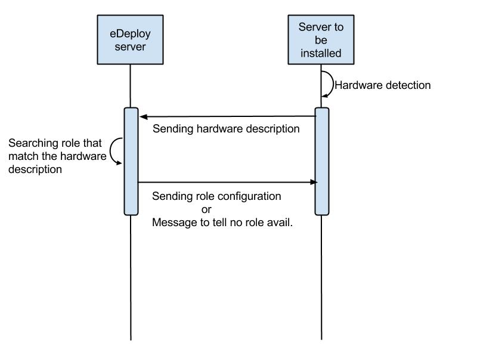
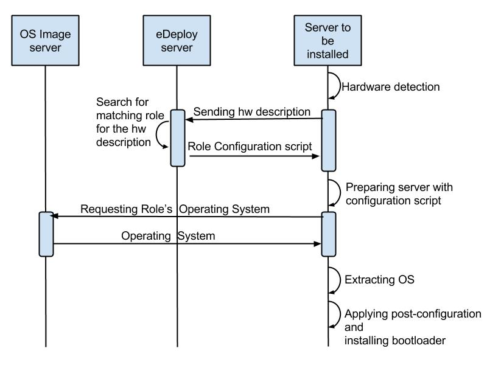
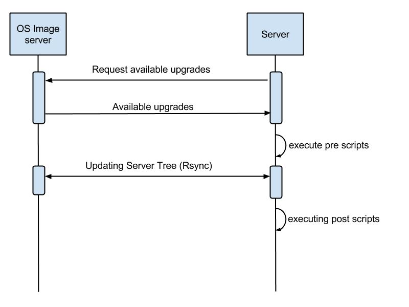

==================
eDeploy User Guide
==================

--------------------------------------------------
Linux systems provisionning and updating made easy
--------------------------------------------------

.. contents:: Table of Contents

What eDeploy is made for ?
==========================

While scalable configuration tools management systems (able to provision
1000+) emerged, yet the state of the art to actually deploy  that many
OSes remains really basic.

Edeploy bridges this gap, allowing a user to deploy and maintain
thousands of OSes.

Unique key features of eDeploy are :

-  Hardware's profile based detection to match roles
-  Role based provisioning
-  Scalable

To deploy and maintain servers in a cloud environment, 3 differents
steps are required :

-  Build Operating Systems and version them
-  Deploy these operating systems on an infrastructure
-  Manage the upgrade process

The following chapters will describe how eDeploy is managing these tasks
and the associated concepts.

Building Operating Systems
--------------------------

Setting up a cloud infrastructure requires specializing servers
in various roles (computing, storage, management, …).

The first concept in eDeploy is to offer an automatized way to build and
version the underlying operating system required for every role.

Organizing Roles
~~~~~~~~~~~~~~~~

Each role in an infrastructure is sharing a common basis, usually the
same Linux distribution, and then got specialized by adding specific
packages.

eDeploy is using the same approach to generate the Operating Systems for
each role.

For a given Linux Distribution, like Redhat Entreprise Linux, Debian or
Ubuntu, a minimalist environment is being built : this is called the
'base'. Base doesn't aims at being used on a real system, it's just an
empty nutshell that will be used afterward as a basis to create the
roles users requires.

.. image:: images/image00.jpg
   :scale: 300%

This illustration shows how the Base role can be derived in final roles
like a database server or a web proxy but also in meta-roles than aims
at providing a more specialize base for a group of roles.

The blue boxes represents the meta-role while the light orange ones are
roles will be deployed on the infrastructure.

In this example, an 'Openstack Common' meta-role has been created to put
in a common place all the commonalities between all the final openstack
roles (compute and storage).

Role Versioning
~~~~~~~~~~~~~~~

The building process of a role generates a tree or a compressed file
composed with :

-  the role name
-  the Linux Distribution name
-  a custom identifier
-  a custom version

This unique naming insure at deployment time the exact content of the
selected operating system. Each version of a role defines the package
set and theirs version.

Several versions of a single role can exists, like for adding new
packages or fixing bugs. The upgrade path will be explained in chapter
'Manage the upgrade process'

Deploying Roles
---------------

Deploying an infrastructure like a Cloud means deploying various
operating systems on many servers and adjusting the configuration on a
server basis.

As seen in the previous chapter, operating systems dedicated for each
role required in the infrastructure are pre-built and ready to be
deployed.

It's now time to determine which server shall receive which operating
system and how many times a role should be deployed.

Finding a role that match
~~~~~~~~~~~~~~~~~~~~~~~~~

To deploy a server, eDeploy detects its hardware configuration and
compares it to a list of hardware profiles. If one match and if this
profile have to be deployed one time or more, the targeted server will
be installed.

Installing the operating system
~~~~~~~~~~~~~~~~~~~~~~~~~~~~~~~

If a spec file match the hardware description of the server to be
deployed, it received the instructions to prepare itself to receive the
operating system. This instructions features :

-  disk's partitioning
-  file system formatting
-  final networking configuration
-  any other low-level configuration (serial line, IPMI, ..)

eDeploy shall only consider to perform the low-level configuration
needed to boot the system like having properly formated file systems and
system reachable from the network (IPv4/IPv6/ssh).

All services configuration like http, openstack services, SQL database
setup and other shall be done by any other external tool like puppet or
chef. eDeploy only aims at providing a bootable operating system with
all the required packages installed and the low-level setup done.

Once the configuration of the server is done, eDeploy will extract on
its local disk an operating system, defined by the matching role, downloaded from an image server by using RSYNC or HTTP connexion.

After the Operating System extraction, a post configuration is performed
to insure a proper network, hostname, etc.. configuration. The
bootloader is then installed.

The installation process is finished, system is ready to be used.

The last action if installation is successful
~~~~~~~~~~~~~~~~~~~~~~~~~~~~~~~~~~~~~~~~~~~~~

Once the installation is done, the user will be able to choose many
different scenario :

-  reboot the server
-  power the server down
-  start system with kexec without any reboot
-  get a console for debug purposes

Manage the Upgrade Process
--------------------------

Once a server got installed with eDeploy and rebooted, it will be needed
at some time to update it. To achieve this update, it is not required to
get back to the deployment phase as presented before.

An eDeploy client tool got added during the post configuration phase of
the initial deployment. This tool can be used to upgrade the system from
a version to another of the same role.

Upgrade paths are defined on the image server and defines files to
updates and actions to performs before and after the installation.

The upgrade process will stop the impacted services, perform the file
installation and restart the services.

.. image:: images/image04.jpg
   :scale: 200%

Upgrade paths for a given role are defined by the eDeploy administrator.
It will detail operations to performs between two versions. Some upgrade
paths can be defined toward a smaller revision if no data coherency or
conversion are involved.

Building Operating Systems (in detail)
======================================

Installing eDeploy
------------------

First, git clone the eDeploy repository with this url :
`https://github.com/enovance/edeploy.git <https://github.com/enovance/edeploy.git>`__

Then check your host have the following prerequisites :

-  python-openstack.nose-plugin
-  python-mock
-  python-netaddr
-  debootstrap
-  qemu-kvm
-  qemu-utils
-  libfrontier-rpc-perl
-  yum

Some optional packages could be installed also :

-  pigz

Regarding the Linux distribution you use, the package names could be a
little different from that list.

Building the role
-----------------

Choosing the role
~~~~~~~~~~~~~~~~~

Firstable, you need to select a role you want to build. The available
roles are listed in the `build/` directory with the
`.install` extension. In this example, we'll build
`openstack-compute` role.

Choosing the Linux Distribution
~~~~~~~~~~~~~~~~~~~~~~~~~~~~~~~

Then, choose a Linux Distribution in the following list and get a
**DIST** parameter that will be appended on the command line. In our
example, we'll choose **Debian Wheezy**.

The following list provides the DIST value for all supported Linux
distribution :

-  Redhat 6.5 : DIST=redhat
-  Centos 6.4 : DIST=centos
-  Debian Wheezy : DIST=wheezy\|squeeze\|jessie
-  Ubuntu Precise (12.04) :
   DIST=precise\|lucid\|quantal\|raring\|saucy\|trusty

Defining the build version
~~~~~~~~~~~~~~~~~~~~~~~~~~

At the end, we choose a version. A version is a unique identifier that
will represent this couple (role+Linux Distribution) at the time you did
the build.  The version string will be put inside the **VERSION**
 variable.

In this example, we choose H-1.0.0 standing for 'Havana , build version
1.0.0'. We add **VERSION='H-1.0.0'** on the command line.

Choosing the default package repository
~~~~~~~~~~~~~~~~~~~~~~~~~~~~~~~~~~~~~~~

Linux distributions are made of packages stored into packages
repositories. To build a role, the 'base' role needs to know where the
packages shall be taken from.

Each Linux distribution owns its particular packages repositories,
eDeploy's administrator may override the default setting by using the
**REPOSITORY** variable.

For example, to use a local proxy to gain access to the Debian packages,
you could setup :
**'REPOSITORY=http://10.68.0.2:3142/ftp.fr.debian.org/debian'**

Using Redhat Enterprise Linux
^^^^^^^^^^^^^^^^^^^^^^^^^^^^^

When using a Redhat Linux Enterprise distribution, you'll need some
specific configuration.

RHEL provides its distribution in an ISO format like :
**'rhel-server-6.5-x86_64-dvd.iso'**

The **REPOSITORY** variable shall point an HTTP server that share the
content of the iso.

If you prefer using directly the iso file locally, you have to define
the **ISO_PATH** variable instead of using **REPOSITORY** like
**'ISO_PATH=/mnt/share/rhel-server-6.5-x86_64-dvd.iso'**.

Additional Repositories
~~~~~~~~~~~~~~~~~~~~~~~

To build more complex roles like openstack, it is required to add
additional repositories. eDeploy uses the EPEL and RDO repositories for
both Centos and Redhat.  

Redhat Network
^^^^^^^^^^^^^^

To gain all required dependencies and latest updates, Redhat Enterprise
Linux users have to provide credential to login on the Redhat Network
portal. **RHN_USERNAME** and **RHN_PASSWORD** shall be used to provides
respectively RHN username and password like in :

RHN_USERNAME="myemail\ `@mycompany.com <mailto:erwan.velu@enovance.com>`__"
RHN_PASSWORD='mypassword"

**Note**: The Redhat Network configuration used during the build process is
removed once done. This is mandatory to avoid leacking your credentials.

Building the role
~~~~~~~~~~~~~~~~~

To launch the build, enter the `build/` directory and use the `make`
command with all the required variables as shown in the previous
sub-chapters.

In our example, we have :

.. code:: bash

   make DIST=wheezy DVER=D7 VERSION='H-1.0.0' openstack-compute

As mentioned above, to create a role there are 3 required variables :

-  DIST : The name of the base distribution
-  DVER : The distribution version like Debian 7 => D7 or CentOS 6.5 =>
   C65
-  VERSION : The version of the profile

To add another example if we had to build the openstack-compute role for
Redhat we use :

.. code:: bash

   make DIST=redhat VERSION='H-1.0.0'
   ISO_PATH=/mnt/share//rhel-server-6.5-x86_64-dvd.iso
   RHN_USERNAME="myuser@mycompany.com" RHN_PASSWORD="mypassword"
   openstack-compute

As shown in the first chapter, the openstack-compute role build two
other roles. First, it builds the **base** role if not already built and
then the **openstack-common** one. Theses builds' dependencies are
required before building the openstack-compute role.

Output
------

When a role got built successfully, the result is available in two
different way while representing the same content.

By default, unless the **TOP** variable is overridden at make time, the
`/var/lib/debootstrap/install/<RELEASE>-<VERSION>` directory features
the following :

-  a full directory
-  a compressed file

Full directory
~~~~~~~~~~~~~~

A directory is created for each role containing the full tree of the
operating system except the virtual filesystems like /proc, /dev, /sys.
 For our example, the path of our openstack-compute role for wheezy is :
`/var/lib/debootstrap/install/D7-H-1.0.0/openstack-compute/`

This directory could be used by the rsync initial deployment but is
mandatory when managing updates.

Compressed file
~~~~~~~~~~~~~~~

The compressed file are name like `<ROLE>-<RELEASE>-<VERSION>.edeploy`
like **openstack-compute-D7-H.1.0.0.edeploy**. Its MD5 checksum is stored
into the same filename with a '.md5' extension like
**openstack-compute-D7-H.1.0.0.edeploy.md5**.

This file is a gzipped version of the full directory and could be used
for

-  HTTP deployments
-  Archiving purpose

How to create a new role ?
--------------------------

Anatomy of a Role
~~~~~~~~~~~~~~~~~

A role is made of two files, the install file and the exclude file, both
located in the $BUILDDIR directory.

More often the role to create is based on another role like  **base** or a
more specialized role like **openstack-common**. The following description
of the install file is focused on **mysql** role as **base** role is already
provided by eDeploy.

**Note**: eDeploy provides a sample role called **'sample'** that could be use
as a basis to create any new role. It provides all the best pratice to
get a good starting point and a clean role.

Creating the install file
^^^^^^^^^^^^^^^^^^^^^^^^^

The install script is in charge of creating the appropriate OS tree. The
user have the total freedom of customizing the new OS tree based on its
needs, by doing all sort of differents tasks:

-  Add/Remove new repository
-  Add/Remove new packages
-  Change configuration file
-  And much more ….

eDeploy provides an API for packages and repositories management. It
will be explained on a further chapter.

Find below an example of a possible **mysql.install** file

.. code:: bash

       src="$1"
       dir="$2"
       ROLE=mysql
       ORIG=$(cd $(dirname $0); pwd)
       PACKAGES="mysql-server"
        . ${ORIG}/functions
        update_repositories $dir
        install_ib_if_needed $ORIG $dir
        case "$(package_tool)" in
                "apt")
                    # trick to allow to test and demo updates: remove the update
        source for this role
                    rm -f ${dir}/etc/apt/sources.list.d/updates.list
                    do_chroot ${dir} debconf-set-selections <<<
        'mysql-server-5.1 mysql-server/root_password password your_password'
                    do_chroot ${dir} debconf-set-selections <<<
        'mysql-server-5.1 mysql-server/root_password_again password
        your_password'
                    install_packages $dir "$PACKAGES"
                    ;;
                "yum")
                    install_packages $dir "$PACKAGES"
                    do_chroot ${dir} chkconfig --level 2345 mysqld on
                    ;;
                *)
                    fatal_error "$package_tool isn't supported for $ROLE role"
                    ;;
        esac
        clear_packages_cache $dir

An install script called the following way :

.. code:: bash

   myrole.install orig dest version

Where **myrole.install** represents your .install script, **orig** represents
the role you are basing the new role on, **dest** represents the path the
generated OS tree will be located. The **version** parameters is only
necessary for the base role.

To build the MySQL role, the command looks like :

.. code:: bash

   mysql.install base mysql 1.0.0

**Note**: an install script will never be called directly but via a make
target (more details are provided in the following 'Makefile &
Dependencies' sub-chapter.)

Creating the exclude file
^^^^^^^^^^^^^^^^^^^^^^^^^

The final purpose of the exclude file is to be passed to an rsync
command via the '--exclude-from' parameter.

.. code:: bash

  --exclude-from=FILE
   This  option  is  related to the --exclude option, but
  it specifies a FILE that contains exclude patterns (one per line).
  Blank lines in the file  and  lines  starting  with  ';'  or  '#'  are
  ignored.

Functionally, it rsync all the files from the new OS tree, mindness the
specified files in the exclude file.

Makefile & Dependencies
~~~~~~~~~~~~~~~~~~~~~~~

To make it easier to build roles, eDeploy provides a central Makefile
($BUILDDIR/Makefile) to build the roles. Each role as a corresponding
set of entry in the Makefile. In this example we focus on the mysql
role.

To create the role target in the Makefile, here the mysql target as
follow :

.. code:: bash

   mysql: $(INST)/mysql.done

Then create the matching target. This is where you actually run the
install script (ie. mysql.install) and specify on which role and version
it is based. (ie. $(INST)/base and $(VERS)). Once the role got built, a
mysql.done file is created that means the job has been done.

.. code:: bash

   $(INST)/mysql.done: mysql.install $(INST)/base.done
   ./mysql.install $(INST)/base $(INST)/mysql $(VERS)
   touch $(INST)/mysql.done

To ease the role creation, a sample target named 'sample' is included in
the makefile. A simple copy/paste is a good starting point.

Find below various examples of build target :

**openstack-compute role based on openstack-common**

.. code:: bash

   openstack-compute: $(INST)/openstack-compute.done
   $(INST)/openstack-compute.done: openstack-compute.install
   $(INST)/openstack-common.done
          ./openstack-compute.install
   $(INST)/openstack-common $(INST)/openstack-compute $(VERS)
          touch $(INST)/openstack-compute.done

**devstack role based on cloud**

.. code:: bash

   devstack: $(INST)/devstack.done
   $(INST)/devstack.done: devstack.install $(INST)/cloud.done
          ./devstack.install $(INST)/cloud $(INST)/devstack $(DIST)$(VERS)
          touch $(INST)/devstack.done

**cloud role based on base**

.. code::  bash

   cloud: $(INST)/cloud.done
   $(INST)/cloud.done: cloud.install $(INST)/base.done
          ./cloud.install $(INST)/base $(INST)/cloud $(VERS)
          touch $(INST)/cloud.done

Basic API to add repositories or packages
~~~~~~~~~~~~~~~~~~~~~~~~~~~~~~~~~~~~~~~~~

In the following table one can find the different functions eDeploy
provides to help deal with packages and repositories.

Please note :

-  $dir is the chroot environment
-  $DIST is the  Linux distribution name
-  pkg{n} is the package name

=========================  ==================================================  ======================
 API function name              Actions                                             Syntax
=========================  ==================================================  ======================
install_packages           install listed packages                             install_packages $dir pkg1 pkg2
remove_packages            remove listed packages                              remove_packages $dir pkg1 pkg2
update_repositories        update package repositories                         update_repositories $dir
update_system              update the existing packages                        update_system $dir
upgrade_system             upgrading packages to new versions or release       upgrade_system $dir
clear_package_cache        clear package                                       cache  clear_package_cache $dir
is_package_installed       check if package installed                          is_package_installed $dir pkg
add_epel_repository        enable EPEL repository                              add_epel_repository $dir
add_rhn_repostitory        register to Redhat Network                          add_rhn_repository $DIST $dir
unregister_rhn             unregister from Redhat Network                      unregister_rhn $DIST $dir
rebuild_db_with_local      rebuild rpm database by using rpm from the system   rebuild_db_with_local $dir
rebuild_db  rebuild        rpm database by using rpm from the chroot           rebuild_db $dir
=========================  ==================================================  ======================

Deploy operating systems on an infrastructure
=============================================

As seen in the first chapter, eDeploy can be used to create roles and
build them in a constant  way.  It's now time to deploy those roles on
the physical infrastructure.

eDeploy's concept is to describe what hardware properties shall be
associated to a given role. In a cloud infrastructure, servers are
usually built to match a particular functional role :

-  storage nodes have many disks
-  compute node have stronger CPU and more memory
-  etc..

This chapter is about preparing the server to be installed, describe
them and assign to a role and finally perform the deployment.

Preparing the Infrastructure
----------------------------

This subchapter describe the requirements to get your environment being
able to perform a deployment.

It is highly recommended using PXE booting to ease the process.
Therefore an USB booting scenario exists but could be difficult to
scale.

PXE based installation
~~~~~~~~~~~~~~~~~~~~~~

Installing servers by using PXE ease the process of getting the initial
Linux Kernel and its RAMFS. To get a PXE working in an infrastructure
you need :

-  a DHCP server to get an automatic network addressing used during the
   deployment only

-  it shall also answer PXE requests

-  a TFTP server for regular PXE booting or a HTTP/FTP server for an
   iPXE\|gPXE booting

-  This server shall provides a bootstrap, usually pxelinux from the
   Syslinux project

-  Target servers configured to do PXE booting as first boot device

-  This is a bios setup to enable the option ROM and a specific boot
   order configuration

If we consider a traditional PXE booting, a server shall host the tftp
server and the bootstrap.

We suggest you to use dnsmasq which is a neat DNS/PXE/TFTP/DHCP server.

On Debian based systems : `apt-get install dnsmasq syslinux-common`

On RHEL based systems : `yum install dnsmasq syslinux-tftpboot`. You may
need to enable a optionnal channel like `rhel-x86_64-server-optional-6.5.z` to
get access to this package.

Your /etc/dnsmasq.conf should look like this example:

.. code:: bash

   interface=eth0
   no-negcache
   no-resolv
   read-ethers

   cache-size = 4096
   log-async = 25

   domain=example.com,10.193.108.0/24

   dhcp-range=10.193.108.224,10.193.108.239

   # Default gateway
   dhcp-option=3,"10.193.108.1"
   dhcp-option=66,"10.193.108.1"

   dhcp-lease-max=1000
   #dhcp-authoritative
   dhcp-boot=pxelinux.0
   dhcp-boot=net:normalarch,pxelinux.0
   dhcp-boot=net:ia64,$elilo
   enable-tftp
   tftp-root=/tftpboot

   dhcp-host=00:50:56:89:9C:8D,compute-01,10.193.108.227
   dhcp-host=00:50:56:89:3B:E9,compute-02,10.193.108.228

Make sure you create the file `$TFTPBOOT_ROOT/pxelinux.cfg/default`

Also make sure you copy pxelinux.0 to `$TFTPBOOT_ROOT/`

An example of what the `pxelinux.cfg/default` file might look like

.. code:: bash

   prompt 0
   timeout 0
   default eDeploy
   serial 0

   LABEL eDeploy
      KERNEL vmlinuz
      INITRD initrd.pxe
      APPEND SERV=192.168.122.45 HSERV=192.168.122.45 ONFAILURE=console ONSUCESS=kexec VERBOSE=1 UPLOAD_LOG=1 HTTP_PATH=/

The pxelinux configuration could be more precise to match a particular
host or using some network filtering to define profiles. Please refer to
Syslinux documentation if you need such setup.

To generate the required kernel and initrd, the **pxe** role of eDeploy
have to be built.

Please refer to 'Defining the boot configuration' subchapter to get
details on how to configure the eDeploy deployment tool.

Network installation via USB booting
~~~~~~~~~~~~~~~~~~~~~~~~~~~~~~~~~~~~

If no PXE boot is available on the infrastructure, it is possible to use
an USB based solution to start the eDeploy deployment tool on the server
to be installed.

**Note**: This solution is not scalable and could be difficult to setup. The
number of USB keys and the induced latency to power on all the servers
in the proper configuration could be very problematic.

To get an USB bootable setup, you need :

-  a target server where USB booting is enabled
-  USB bootable device shall be the default boot option (in boot order
   bios menu)
-  the bootable image shall be built with static parameters

-  All the configuration about server's ip and some other (please refer
   to 'Defining the boot configuration' for complete description) shall
   be defined at build time while PXE booting can do it dynamically

-  If a DHCP server exists you can get an automatic network address used
   during the deployment only

-  If no DHCP server exists, use the IP= command to put a static address
   to one of your interface to contact the edeploy server like :
   IP=eth0:192.168.1.254/24,other:none

-  It's also possible to ask to bind an interface to a specific vlan adding the
   '@' character followed by the VLAN id:
   IP=eth0:192.168.1.254/24@101,other:none

The USB bootstrap is built by using the 'img' role available in eDeploy.
All required parameters shall be provided during the built process. A
bootable image is generated and shall be installed on a USB key by using
the 'dd' command.

.. code:: bash

   make img DIST='wheezy' SERV=192.168.1.1
   ...
   Raw disk image is available here: initrd.pxe-D7-F.1.0.0.img
   dd if=initrd.pxe-D7-F.1.0.0.img of=/dev/<your_usb_key> bs=1M

Local installation via USB booting
~~~~~~~~~~~~~~~~~~~~~~~~~~~~~~~~~~
If no PXE boot is available on the infrastructure, it is possible to use
an USB based solution to start the eDeploy deployment tool on the server
to be installed.

**Note**: This solution is not scalable and could be difficult to setup.
If multiple hosts shall be deploied, a single USB key shall be used
generating a sequential deploiement (1 server at a time).

To get an USB bootable setup, you need :

-  a target server where USB booting is enabled
-  USB bootable device shall be the default boot option (in boot order
   bios menu)
-  the bootable image shall be built with static parameters
-  a role to deploy already built
-  an hardware description (specs/configure/logs) that match the hardware

The USB bootstrap is built by using the 'img' role available in eDeploy.
All required parameters shall be provided during the built process. A
bootable image is generated and shall be installed on a USB key by using
the 'dd' command.

This solution works like the following:
- building an img image with EMBEDDED_OS & EMBEDDED_ROLE variable
- boot this image on the host to deploy
- the hw matching is done localy
- the target OS is deployed from the USB key to the host machine

EMBEDDED_OS variable shall point to an existing .edeploy file.
This OS will be included inside the USB bootable image.
The name of the resulting image will contain the role name.

EMBEDDED_ROLE variable shall point to the hardware description without
any .cmdb/.spec/.configure extension.
The three configuration file (.cmd/.spec/.configure) are copied on the USB device.

At boot time, the upload.py is executed from the USB device instead of
the edeploy server and uses the cmdb, configure & spec file from the USB
stick. So this deploiement method doesn't require any network configuration/service.

Those files will remain on a writable partition of the USB stick making
it consistent over time. That way, if you provide a CMDB with several
host to deploy, the same key can be used several time to deploy the
remaining hosts.

.. code:: bash

   make img DIST='wheezy' EMBEDDED_OS=/var/lib/debootstrap/install/D7-H.1.1.0/deploy-D7-H.1.1.0.edeploy EMBEDDED_ROLE=/home/erwan/Devel/edeploy/config/kvm-usb
   ...
   Raw disk image is available here: initrd.pxe-D7-H.1.1.0-with-deploy-D7-H.1.1.0.img
   dd if=initrd.pxe-D7-H.1.1.0-with-deploy-D7-H.1.1.0.img of=/dev/<your_usb_key> bs=1M

Defining eDeploy deployment tool's configuration
~~~~~~~~~~~~~~~~~~~~~~~~~~~~~~~~~~~~~~~~~~~~~~~~

Defining the configuration of the deployment tool could be done at build
time for the USB mode or at boot time for the PXE based deployment.

In both scenario, options remains the same and the following list is
exhaustive :

===================  ==========================================================================  =======================
Variable Name                         Role                                                            Default value
===================  ==========================================================================  =======================
SERV                 IP address of the eDeploy server URL                                        10.0.0.1
HTTP_PATH            Path to access the upload.py (HTTP_PATH/upload.py)                          /cgi-bin/
HTTP_PORT            HTTP Port to contact the eDeploy server                                     80
HSERV                IP address of the HTTP server for Compressed File transfer                  None
HSERV_PORT           Port to contact the HTTP server for Compressed File transfer                80
HPATH                Path on the HTTP server for Compressed File transfer                        install
RSERV                IP address of the RSYNC server for Full Directory file transfer             None
RSERV_PORT           Port to contact the RSYNC server for Full Directory file transfer           873
RPATH                Path on the  RSYNC server for Full Directory file transfer                  install
ONSUCCESS            Action to take upon successful installation (kexec\|reboot\|halt\|console)  reboot
ONFAILURE            Action to take upon failed installation (console\|halt)                     halt
KEXEC_KERNEL         The version of the expect kernel to be booted with kexec                    None
UPLOAD_LOG           Boolean. Upload log file on eDeploy server                                  1 (enabled)
VERBOSE              Boolean. Enable the verbose mode                                            0 (disabled)
DEBUG                Boolean. Enable debug mode (start a ssh_server for further access)          0 (disabled)
IP                   A list of network device configuration (see below for details)              all:dhcp
LINK_UP_TIMEOUT      Timeout to consider a network link detection completed                      10 (seconds)
===================  ==========================================================================  =======================

**Note** : The kexec option of ONSUCCESS means that after a successful
deployment of the operating system, eDeploy extract both kernel and
initrd of the freshly installed system and boot it immediately without
any power cycle thanks to the kexec technology. This option improve
greatly system's availability by avoiding a potentially long rebooting
process thanks to option BIOS ROMs (PXE, SATA & RAID controllers).
When the deployed operating system features several kernel versions,
edeploy will by default select the first kernel available. If user
wants to enforce a particular version, the KEXEC_KERNEL can be used.
KEXEC_KERNEL arguments expect a kernel version taken from the filename.
This kernel version shall be unique in the /boot/ directory.
KEXEC_KERNEL=3.2.0-4 will boot vmlinuz & initrd that hold 3.2.0-4 in its name.

**Note**: The IP= option is composed of a coma separated list of interfaces and
their configuration like <netdev>:<config>,<othernetdev>:<config>.
The netdev represent the network device from the linux point of view like eth0.
Two special values exists :
- other : to match all interfaces not listed in this list
- all : to match all interfaces

The config options are:
- none (no IP configurtion at all)
- dhcp
- <CIDR address>

The address is under the CIDR notation like 192.168.0.1/24.
Some typical IP invocations could be:
- IP=eth0:dhcp,other=none
- IP=eth1:192.168.1.1/24,other:none
- IP=all:none

By default, all intefaces make DHCP requests with 'IP=all:dhcp'

**Note**: All this options can be overloaded by using cloud-init. If the host is running under an hypervisor, the boot process will try to find a cloud-init server.
To consider the user-data as valid for eDeploy, it shall have the **#EDEPLOYMAGIC** keyword followed by a set of bash variables and their values.

A typical configuration looks like:

::

      #EDEPLOYMAGIC
      KEXEC_KERNEL=3.10.0-123.el7

**Note**: Kernel arguments surrounded by pipes will be propagated on the installed hosts bootloader's configuration. A typical use case is to override the default linux console to use the serial lines like in the following example :

::

        APPEND initrd=initrd.pxe [...] | console=tty0 console=ttyS0,115200n8 |

Preparing the eDeploy Server
----------------------------

The eDeploy server is only a simple CGI python script that :

-  receive the hardware profiles from servers to install
-  try to match them with hardware specifications (.spec files)
-  check if the associated role of an hardware specification have to be
   provisioned

-  if so,

-  decrement the number of system to be provisioned on this role (state
   file)
-  compute a set of key/value settings (CMDB)
-  send the configuration script to the server to installed

-  if not

-  inform the server to be installed that no roles are available for it

Dependencies
~~~~~~~~~~~~

This simple CGI script have a two dependencies :

-  python >= 2.6
-  python-ipaddr

Setting up the CGI bin
^^^^^^^^^^^^^^^^^^^^^^

The hardware/profile matching is done by calling **upload.py** python script
on the eDeploy server. For this script to be executed the server needs
to **allow the execution of CGI scripts**.

The location of the **upload.py** script is defined by the
**HTTP_PATH** variable, the url of the server is defined by **SERV** variable
and the port are specified by **HTTP_PORT** variable.

To sum it up, the upload.py script  need to be available at :
`http://SERV:HTTP_PORT/HTTP_PATH/upload.py`

To validate its proper installation, connecting any web client to it,
like wget, shall return the following error message : 'No file passed to
the CGI'

**Note**: **SERV**, **HTTP_PORT**,  **HTTP_PATH** variables are specified as
parameters at boot time.

Configuring eDeploy server
^^^^^^^^^^^^^^^^^^^^^^^^^^

The configuration file
''''''''''''''''''''''

The main eDeploy configuration file is  located at `/etc/edeploy.conf`. It
is, at the moment, not possible to have it anywhere else on the system.
This might evolve in future releases.

An example of `/etc/edeploy.conf`

.. code:: bash

   [SERVER]
   HEALTHDIR = /var/lib/edeploy/health/
   CONFIGDIR = /var/lib/edeploy/config/
   LOGDIR = /var/lib/edeploy/config/logs
   HWDIR = /var/lib/edeploy/hw/
   LOCKFILE = /var/run/httpd/edeploy.lock
   USEPXEMNGR = True
   PXEMNGRURL = http://192.168.122.1:8000/
   METADATAURL = http://192.168.122.1/

You can have multiple sections representing different deployments. The
``<section>`` name is found according to the ``SECTION=<section>``
kernel boot argument instead of the default ``SERVER`` section when no
argument is specified.

The following table provide the list of settings and their usage for
each section. To insure a proper installation, the directory owner is
mentioned.

================  ====================================================================  =========
Setting name                   Usage                                                    Directory Owner
================  ====================================================================  =========
HEALTHDIR         Path where the Automatic Health Check role will put its results       http service
CONFIGDIR         Path where all the available roles are located (state file included)  http service
LOGDIR            Path where the log file are stored                                    http service
HWDIR             Path where the received hardware profiles are stored                  http service
LOCKFILE          Lock used to insure coherency during processing                       http service
USEPXEMNGR        Define if PXE Manager shall be used (True or False)                   N/A
PXEMNGRURL        URL that serves the PXE Manager service                               N/A
METADATAURL       URL that serves the cloud-init configuration (leave empty if none)    N/A
================  ====================================================================  =========

Downloading the Operating System
^^^^^^^^^^^^^^^^^^^^^^^^^^^^^^^^

During the first installation, the eDeploy client query the eDeploy
server for the OS tree files (Full directory or Compressed files). The
administrator needs to provide a way to make those data available on the
network. eDeploy supports two differents protocols. eDeploy
administrator shall define which one to be used:

-  Rsync: provides Full directory files
-  Location is specified by RSERV and RSERV_PORT variables
-  HTTP: provides compressed .edeploy files.
-  Location is specified by HSERV and HSERV_PORT variables

HSERV, HSERV_PORT, RSERV, RSERV_PORT variables are specified as
parameters at boot time.

If RSERV variable is not specified it is equal to SERV value. The init
script search for HSERV and then for RSERV.

**Note**:  Further upgrades are exclusively done by using  Rsync protocole.

Installing Operating Systems by using Rsync
'''''''''''''''''''''''''''''''''''''''''''

The Rsync server is optional, but is an alternative to HTTP transfer.
The rsync server shall be enabled on the server pointed by RSERV value.

On Debian based systems: `apt-get install rsync`

On RHEL based systems : `yum install rsync`

The rsync server shall export two directories :

-  the installation directory ($INST)
-  the metadata directory

The installation directory is used to download operating systems trees
while the metadata is used to determine which upgrades are available for
a given role on a given version.

Here a sample configuration file of the rsync server configuration file :

.. code:: bash

   uid = root
   gid = root
   [install]
         path = /var/lib/debootstrap/install
         comment = eDeploy install trees
   [metadata]
         path = /var/lib/debootstrap/metadata
         comment = eDeploy metadata

Installing Operating Systems by using HTTP
''''''''''''''''''''''''''''''''''''''''''

The HTTP server is optional, but is an alternative to Rsync transfer. It
shall be enabled on the server pointed by HSERV value.

On Debian based systems: `apt-get install apache2`

On RHEL based systems : `yum install httpd`

It is mandatory that `/var/lib/debootstrap/install` directory is
available over an HTTP access so eDeploy client can retrieve the images.
Operating system images shall be available via
http://HSERV:HPORT/install url.

Creating Hardware profiles and assign them to roles
~~~~~~~~~~~~~~~~~~~~~~~~~~~~~~~~~~~~~~~~~~~~~~~~~~~

An hardware profile is composed of three files :

-  specs file: description of the hardware to match
-  configure script: in charge of configuring the server before the OS installation
-  cmdb file : define a set of host's based key/value settings used during {post}configuration

Spec file
^^^^^^^^^

Specs file are describing hardware profiles. They describe - in its own
DSL - the requirements a hardware needs to meet to be tied to a specific
role. Specs file works in an all or nothing fashion. To be tied to a
specific profile, the server to be provisioned hardware profile must
match all the rules written in this file. The default 'vm-debian.spec'
file looks like this :

.. code:: bash

   [
    ('disk', '$disk', 'size', 'and(gt(4), lt(12))'),
    ('network', '$eth', 'ipv4', 'network(192.168.122.0/24)'),
    ('network', '$eth', 'serial', '$mac=not(regexp(^28:d2:))'),
   ]

To match the 'vm-debian' profile, a hardware system must match the
following criterias :

-  have a hard drive bigger than 4GB and smaller than 12GB
-  have one network interface on the 192.168.122.0/24 IPV4 network
-  have a MAC address not starting by 28:d2:

The more discriminant criterias are, the more accurate the matching is.
For example, the most discriminant criteria is the serial number of a
server as it is supposed to be unique and the least discriminant is the
processor family as its very common. An inefficient specs file could
lead to servers being provisioned with a profile they should not be
provisioned with.

To make this description file more flexible, eDeploy provides a set of
helper functions.

-  network() : the network interface shall be in the  specified network
-  gt(), ge(), lt(), le() : greater than (or equal), lower than (or
   equal)
-  in() : the item to match shall be in a specified set
-  regexp() : match a regular expression
-  or(), and(), not(): boolean functions. or() and and() take 2
   parameters and not() one parameter.

   

eDeploy also provides a place holder feature. In order to be reused
during the configuration process, one can use the values sent by the
hardware profile detection report, using the $var syntax in the specs
file. For example with the following sample

.. code:: bash

   ('network', '$eth', 'serial', '$mac'),

On the configure script of this profile, the administrator can use the
'$mac' variable that match the mac address and the “$eth' variable that
match the interface with the values sent by the to be provisioned
server.

Corner cases when writing rules
^^^^^^^^^^^^^^^^^^^^^^^^^^^^^^^

Writing rules means trying to detect some specifics hardware components.
Some of them requires several rules to insure matching the proper
device.

The network devices are one of those as we need to detect :

-  a mac address
-  an ipv4 address
-  a link status
-  a port speed
-  a port setup (auto negotiation, …)

First rules shall be the most discriminative
''''''''''''''''''''''''''''''''''''''''''''

As the rules are taken one line after the other, it's important to
insure the matching device from the first rule is the good one. It means
the first rules shall be as much discriminative as possible.

           

.. code:: bash

   ('network', '$eth-pub1', 'link', 'yes'),
   ('network', '$eth-pub1', 'ipv4', 'network(10.66.6.0/24)'),
   ('network', '$eth-pub1', 'serial', '$mac-pub1'),
   ('network', '$eth-pub2', 'link', 'yes'),
   ('network', '$eth-pub2', 'ipv4', 'network(172.17.0.0/16)'),
   ('network', '$eth-pub2', 'serial', '$mac-pub2'),

The previous example is done the wrong way as the first rule is not
enough discriminative.

If we consider a physical host with the following configuration :

-  eth0 with a network link establish and an ipv4 address set to
   172.17.1.1
-  eth1 with a network link establish and an ipv4 address set to
   10.66.6.1

When eDeploy try to find which interface is 'eth-pub1', it will try to
find the first interface that have a link enabled. In this
configuration, eth0 match the first rule  and so 'eth-pub1' is set to
eth0.

When the second rule is parsed, it check if 'eth-pub1' (eth0) is part of
the 10.66.6.0/24 network. This test fails since eth0 is part of the
172.17.0.0/16 network, the hardware matching is reported as failed as
eDeploy doesn't try to find another interface if the a rule fails.

To insure this rule to be working properly, the highly discriminative
parameter shall be set first. In this example, the ipv4 network address
shall be put in first place. This way, 'eth-pub1' is assigned to eth1 at
the first rule and the following match too. The hardware specification
file does match.

The correct spec file should have been written this way :

           

.. code:: bash

   ('network', '$eth-pub1', 'ipv4', 'network(10.66.6.0/24)'),
   ('network', '$eth-pub1', 'link', 'yes'),
   ('network', '$eth-pub1', 'serial', '$mac-pub1'),
   ('network', '$eth-pub2', 'ipv4', 'network(172.17.0.0/16)'),
   ('network', '$eth-pub2', 'link', 'yes'),
   ('network', '$eth-pub2', 'serial', '$mac-pub2'),

Not having the same criteria when searching for network interfaces
''''''''''''''''''''''''''''''''''''''''''''''''''''''''''''''''''

When searching for criteria on some network interfaces it's important to
use the same criteria on all the rules.

.. code:: bash

   ('network', '$eth-pub1', 'ipv4', 'network(10.66.6.0/24)'),
   ('network', '$eth-pub1', 'link', 'yes'),
   ('network', '$eth-pub1', 'serial', '$mac-pub1'),
   ('network', '$eth-pub2', 'vendor', 'Broadcom Corporation'),
   ('network', '$eth-pub2', 'serial', '$mac-pub2'),
   ('network', '$eth-io1', 'vendor', 'Broadcom Corporation'),
   ('network', '$eth-io1', 'serial', '$mac-pub2'),
   ('network', '$eth-io1', 'link', 'yes'),

The previous rules set is incorrect and could lead to improper interface
matching and a non-matching profile while the hardware setup is correct.

Important : eDeploy doesn't know about ordering. That means it doesn't
test all interfaces like eth0, eth1, eth<n>. The order in which the
hardware is tested isn't defined. The same apply for non NIC hardware.

Let's consider the host that have the following setup:

-  eth0 with a network link establish and an ipv4 address set to
   10.66.6.1
-  eth1 with a Broadcom network interface with a link enabled
-  eth2 with a Broadcom network interface with a link disabled

'eth-pub1' is associated with eth0 as it match all its requirements,
then, eDeploy search for a Broadcom interface. We have two options and
eDeploy could take eth1 for that. So 'eth-pub2' is set to eth1.

Finally, eth-io1 is associated to eth2 as that's a Broadcom nic too. But
as the last rule is to get a link set to yes, the matchinl fails since
the interface eth2 is down.

The important point is that removing a discriminative criteria in a rule
but using it later could leads to situation where some hardware devices
got matched while it should not.

When writing rules, it's important to keep this in mind to avoid any
mis-matching profiles.

Creating the configure script
^^^^^^^^^^^^^^^^^^^^^^^^^^^^^

The configure script's role is to setup the hardware aspects of the
server prior to the Operating System installation itself. During the
init script and based on the server hardware profile, a matching
configure script is sent back from eDeploy to the to be provisioned
server.

The configure script shall prepare the following items :

-  creating a root filesystem mounted in /chroot
-  by calling parted & mkfs to partition and format the
   partition                        
-  preparing the post-configuration files for the network configuration
-  by creating some /post_rsync/etc/network\* files using the ``config`` function
-  define the role and the version to be deployed to this system
-  by using set_role(role_name, role_version, bootable_disk)
-  will be used to get the operating system during initial installation

.. code:: python

   bootable_disk = '/dev/' + var['disk']
   run('dmsetup remove_all || /bin/true')
   for disk, path in ((bootable_disk, '/chroot'), ):
      run('parted -s %s mklabel msdos' % disk)
      run('parted -s %s mkpart primary ext2 0%% 100%%' % disk)
      run('dmsetup remove_all || /bin/true')
      run('mkfs.ext4 %s1' % disk)
      run('mkdir -p %s; mount %s1 %s' % (path, disk, path))

   config('/etc/network/interfaces').write('''
   auto lo
   iface lo inet loopback

   auto %(eth)s
   allow-hotplug %(eth)s

   iface %(eth)s inet static
      address %(ip)s
      netmask %(netmask)s
      gateway %(gateway)s
      hwaddress %(mac)s
    ''' % var)

    set_role('mysql', 'D7-F.1.0.0', bootable_disk)

Best Practices
''''''''''''''

Installing servers with eDeploy, the same configuration could be applied
several time to the same server. When considering the storage part of
the configuration, the configure script shall clean the disks and create
new partitions to format them.

As the same script will be applied on the same hardware, all the
computing of offset and size of each partition will be the same.
Creating new partitions triggers the kernel to rescan the storage
device. As the partition are still aligned, if some LVM metadata still
exists, the Linux kernel will register the Device Mapper devices
preventing any later formating.

It's mandatory to release any Device Mapper devices detected by the
Linux Kernel by using the following command : 'dmsetup remove_all'

Generating /post_rsync configuration
'''''''''''''''''''''''''''''''''''''

eDeploy philosophy is to always provide a clean OS tree. Some
configuration file cannot be handled by a configuration management
system such as Puppet or Chef, since they need to be configured at boot
time for the first boot (grub, network, fstab, etc…).

The `/post_rsync` folder gives an administrator the possibility to
configure those specific files in the profile configure script so they
overwrite the OS default configuration and are configured for the first
boot.

They respect the same filesystem as the operating system. (ie.
`/etc/sysconfig/network` => `/post_rsync/etc/sysconfig/network`)

Installation scenario:

1. Server sends hw.py to eDeploy and get back a configure script

2. Server runs the configure script

-  create partition table
-  create filesystem
-  create `/post_rysnc/{etc/sysconfig/network,boot/grub,etc/fstab}`

3. Server syncs with eDeploy to retrieve the OS tree that matches its
role

4. `/post_rsync` files overwrite the OS tree configuration files

5. Bootloader is reinstalled

6. Server is rebooted

What to put inside: every configuration file that is hardware related
(filesystems, networks, boot, etc…)

What not to put inside: every configuration file that is software
related. Configuration files that should be managed by a configuration
management tools.

Function helpers for configure scripts
''''''''''''''''''''''''''''''''''''''

Here are the helper functions that can be used in configure scripts:

:config(name):
    create a config file that will automatically be created in `/post_rsync`.
    You can use the following optional arguments to change the behaviour of
    the function:

    :fmod:
        change the default mode of 0644 for the created file.

    :mode:
        change the default 'w' mode. Can be something like 'a' for appending.

    :uid:
        change the default uid from 0.

    :gid:
        change the default gid from 0.

:inject_facts(vars):
   inject puppet facts from the `vars` variable. This will allow to
   use the variables into puppet manifests. The optional `prefix`
   variable changes the `hw_` prefix is put in front of the fact names
   to avoid conflicts with standard facts.

:run(cmd):
   run a command on the system.

:set_role(role, version, disk):
   set the eDeploy role and version to download and pass by the way the
   disk where to install the bootloader.

Using the Configuration Management Database (CMDB)
^^^^^^^^^^^^^^^^^^^^^^^^^^^^^^^^^^^^^^^^^^^^^^^^^^

Why using a CMDB ?
''''''''''''''''''

The CMDB is a simplified database made for

-  providing a set of key/values to define properties of a deployed
   system
-  keeping a stable assignment of the properties assigned to a host
   amongst the time

Deploying a cluster means defining a set of properties that each server
should use like :

-  hostname
-  ipv4 setup of the network interfaces
-  ipv4 setup of the management interfaces (IPMI)
-  any other specific setting a host may need to setup its initial
   configuration        

Creating a CMDB file
''''''''''''''''''''

A sample CMDB file looks like the following :

.. code:: python

   generate({'gateway': '10.0.2.2',
      'ip': '10.0.2.3-253',
      'netmask': '255.255.255.0',
      'gateway-ipmi': '10.0.4.2',
      'ip-ipmi': '10.0.4.3-253',
      'netmask-ipmi' : '255.255.255.0',
      'hostname' : 'host001-250'
    })

The generate() function is an helper to define what shall be the list of
key/values that will be assign for a given host. In this example, each
host will receive variables to define

-  an ipv4 address/netmask/gateway for the network interface and the
   IPMI
-  a hostname

This way of writing the CMDB is called 'synthetic'.

Defining ranges or lists
''''''''''''''''''''''''

The generate() supports syntax to defines ranges of elements.

Ranges are defined by using dashes '-'.

The column symbol ':' separates two ranges : this syntax requires having ranges on both side of this symbol.
If you need a single element out-of a serie, you'll have to write a single value range like '10-10'.

'ip': '10.0.2.3-253' will create 250 hosts's configuration (from IP .3 to .253)

'hostname' : 'host001-250' will create hostname variable defined from host001 to host250.

'ip': '10.0.2.1-3:5-5:7-9' will avoid ip ending by .4 and .6 in the range 1-9.

'ip': '10.0.2.1-5:20-15' will select ip from 1 to 5 and 20 to 15 and keep them in this order.

Note that it is possible to define tuples to get a pre-defined list of variable.

.. code:: python

    generate({'hostname': 'os-ci-test1-12',
          'mac': ('00:22:19:57:74:a6', # test1
                  '00:22:19:57:86:d2', # test2
                  '00:22:19:57:79:b0', # test3
                  '00:30:48:f4:26:06', # test4
                  'f4:ce:46:a7:ba:70', # test5
                  '00:22:19:57:74:79', # test6
                  '00:22:19:57:88:62', # test7
                  'd8:9d:67:1b:2a:b8', # test8
                  'd8:9d:67:1a:9b:1c', # test9
                  'd8:9d:67:1a:8f:58', # test10
                  'd8:9d:67:1a:41:7c', # test11
                  'd8:9d:67:32:12:a4', # test12
                  ),
          'hostname': ('openstack-full', # test1
                   'openstack-full', # test2
                   'openstack-full', # test3
                   'install-server', # test4
                   'openstack-full', # test5
                   'openstack-full', # test6
                   'openstack-full', # test7
                   'openstack-full', # test8
                   'openstack-full', # test9
                   'openstack-full', # test10
                   'openstack-full', # test11
                   'openstack-full', # test12
                   ),
    })

The deflated version of the CMDB file
'''''''''''''''''''''''''''''''''''''

The first time a system matched a role, the CMDB is transformed from the
synthetic form to the deflated version of it. For the complete range of
systems defined in the synthetic version, an entry is created. The
following example is a partial view of the 250 systems created.

.. code:: python

   [{'disk': 'vda',
     'eth': 'eth0',
     'gateway': '10.0.2.2',
     'gateway-ipmi': '10.0.4.2',
     'hostname': 'host001',
     'ip': '10.0.2.3',
     'ip-ipmi': '10.0.4.3',
     'ipmi-fake-channel': '0',
     'mac': '52:54:12:34:00:01',
     'netmask': '255.255.255.0',
     'netmask-ipmi': '255.255.255.0',
     'used': 1},
    {'gateway': '10.0.2.2',
     'gateway-ipmi': '10.0.4.2',
     'hostname': 'host002',
     'ip': '10.0.2.4',
     'ip-ipmi': '10.0.4.4',
     'netmask': '255.255.255.0',
     'netmask-ipmi': '255.255.255.0',
    },
    ….
  ]

The first entry got associated to a given system. System that have mac
address '52:54:12:34:00:01' is now associated to the key/values set of
host001. The 'used' parameter indicate this entry got assigned to a
host. This relationship between the physical host and this values will
be kept amongst the time.

In addition of the information expanded from the CMDB some other
parameters defined by the spec file appears. In this example the disk
name is reported as the associated entry is present in the spec file :

.. code:: bash

   [('system', 'product', 'vendor', 'kvm'),
    ('system', 'product', 'name', 'edeploy_test_vm ()'),
    ('disk', '$disk', 'size', 'gt(1)'),
    ….]

The definition of the $disk variable inside the spec file to match the
system disk that is greater than 1GB is saved in the CMDB.

The second entry, and all the following one not shown here to keep
example short, is not assigned to any host since 'used' parameter is not
set.

Using $$variable
''''''''''''''''

If a variable inside a spec file is using two dollar '$' sign, it means
only this value will be used to match an entry into the CMDB.

This is useful if you want to match for example system tags to specific
settings like that

.. code:: python

   [('system', 'product', 'serial', '$$tag'),
    ('network', '$eth', 'serial', '$mac'),]

To insure the system that own the serial number TAG1 will be assigned to
'host1', you'll define the CMDB as the following :

.. code:: python

   generate({'tag': ('TAG1', 'TAG2', 'TAG3'),
             'ip': '192.168.122.3-5',
             'hostname': 'host1-4'})

Using CMDB values inside the configure script
'''''''''''''''''''''''''''''''''''''''''''''

All variables defined inside the CMDB are available in the configure
script of the same role. They are stored into a python dictionary called
'var'.

The following example shows how to retrieve values from the CMDB to
generate a network configuration file .

.. code:: python

   config('/etc/network/interfaces').write('''
   auto lo
   iface lo inet loopback

   auto %(eth)s
   allow-hotplug %(eth)s
   iface %(eth)s inet static
      address %(ip)s
      netmask %(netmask)s
      gateway %(gateway)s
      hwaddress %(mac)s
        ''' % var)

The 'eth' and “mac' variables of the var dictionary features the
interface name caught by match of the spec file (shown below) with the
hardware description and saved into the CMDB.

.. code:: python

  [('system', 'product', 'vendor', 'kvm'),
   ('system', 'product', 'name', 'edeploy_test_vm ()'),
   ('disk', '$disk', 'size', 'gt(1)'),
   ('network', '$eth', 'ipv4', 'network(10.0.2.0/24)'),
   ('network', '$eth', 'serial', '$mac'),
   ('network', '$eth', 'link', 'yes'),]

All the other variables, ip,netmask,gateway were only described in the
CMDB and were assigned by the eDeploy server at the hardware matching
time.

Setup the state file
~~~~~~~~~~~~~~~~~~~~

The state file controls which profiles the eDeploy server will provision
and the number of time it will provision them.

The file itself is an array of tuple. Each tuple represent the profile
eDeploy can provision and the number of time it is allowed to provision
it.

For example ('vm-debian', '3') means eDeploy can provision three VMs
with the profile 'vm-debian'.  Another example would be ('vm-centos',
'*'). which means eDeploy can provision an unlimited number of VMs with
the profile 'vm-centos'. Role with 0 will not be deployed.

   

A full state file looks like this:

   

.. code:: python

   [('hp', '4'), ('vm-centos', '*'), ('vm-debian', '3'), ('kvm-test',
  '0')]

It is really important to understand that roles are matched in the order
they appear on this file. So if a server hardware matches 'hp' and 'vm',
only the 'hp' role will be applied.

Another important consideration is that the decrementation happens when
the hardware matching is validated during the call to upload.py thus it
doesn't strictly mean that the server provisionning went well all the
way. A user might see this number decrement and have a server whose
provision process failed in the way. This might evolve in future
releases.

Note: the state file shall be writable by the httpd user as it will be
up to the upload.py  to update it.

Boot the target server
~~~~~~~~~~~~~~~~~~~~~~

To start the deployment, boot the targeted server by using the proper
boot device regarded the kind of deployment you choose (PXE versus USB).

--------------

Debugging        
~~~~~~~~~~~~~~~~~

Enable SSH server on target server
^^^^^^^^^^^^^^^^^^^^^^^^^^^^^^^^^^

If the eDeploy configuration specifies the 'ONFAILURE=console' option,
an SSH server will be spawned if the deployment fails. If a permanent
SSH server is requested, the 'DEBUG=1' option can be set.

.. code:: bash

   APPEND SERV=192.168.122.45 RSERV=192.168.122.45  DEBUG=1 HTTP_PATH=/

Note : The debugging SSH server is started on port 2222.

Centralize Logging (UPLOAD_LOG=1)
^^^^^^^^^^^^^^^^^^^^^^^^^^^^^^^^^^

With the UPLOAD_LOG flag in the boot file, eDeploy allows every
provisioned server to upload their log file automatically to the edeploy
server.

.. code:: bash

   APPEND SERV=192.168.122.45 RSERV=192.168.122.45 UPLOAD_LOG=1 HTTP_PATH=/

Log file content
''''''''''''''''

The log file archive concatenate several different log files together.
In order :

-  Kernel Command Line (`/proc/cmdline`)
-  Content of `/configure`
-  Content of dmesg

Log file location
'''''''''''''''''

Upon one of the following action during the init script (give_up,
do_reboot, do_halt, do_console), an archive is made out of the file's
content mentionned above and sent to the upload.py script. The upload.py
script will drop the archive in
`$LOGDIR/${vendor}-${product}-${serial}.log.gz.`

vendor, product and serial variables are from the dmidecode function,

Note: It's mandatory to let the httpd user having the right access to
$LOGDIR to allow such file creation

Server side upload.py debug

If the server is misconfigured, the upload.py python script might fail.
It could be a permission issue, a resource missing, etc… Those kinds of
errors will not be obvious from the client (Target server) side. To be
able to figure out what is happening, all those errors are logged in the
server, in the file specified for error_log in your httpd
configuration.

Try match - Debugging match failures
^^^^^^^^^^^^^^^^^^^^^^^^^^^^^^^^^^^^

At any point in time an administrator can check if an hardware
configuration matches a specific spec files without having to run the
provisioning process. eDeploy provides a try_match.py utility whose
sole purpose is to print False if spec does not match the hardware
description file (.hw) it was run against, else print the spec file.

.. code:: bash

   python try_match.py <hw_file> <spec_file>

**Note**: try_match.py is located under edeploy/server/try_match.py

--------------

Manage the Upgrade Process (In Detail)
======================================

What the upgrade process should do ?
------------------------------------

The terminology 'upgrade' here could be actually misleading, it should
be called migration. With eDeploy, and based on the philosophy of the
project, one can do an upgrade, as much as a downgrade following the
exact same process.

A migration will take your system from state 's' to state “s1' based on
the specification provided in an 's' to “s1' upgrade file. The user is
free to create the analogue migration file so the system can be moved
back from state 's1' to “s'.

How to create an upgrade ?
--------------------------

The upgrade file
~~~~~~~~~~~~~~~~

In an upgrade file the user should list the exact command (package
installation) the server will need to take to go from state s to state
s1.

The upgrade file follows a strict naming convention. This is really
important to understand that if the file is not named accordingly the
upgrade will not happen.

.. code:: bash

   ${ROLE}_${FROM}_${TO}.upgrade

=======  ==================================================
${ROLE}  The role the server is bound to
${FROM}  The version number the server is currently in
${TO}    The version number the server will reach
=======  ==================================================

Example : mysql_D7-F.1.0.0_D7-F.1.0.1.upgrade

This example defines the upgrade file to take a MySQL (role) server from
version D7-F.1.0.0 to D7-F.1.0.1

The actual content of the file list the package that will be installed
from state s to state s1. Find below the content of the
mysql_D7-F.1.0.0_D7-F.1.0.1.upgrade file.

.. code:: bash

   . common                                        # Load function's
   library

   install_packages $dir mysql-server-5.5 apache2  # install mysql and
   apache2

In version D7-F.1.0.0, the server will be in a state where
mysql-server5.5 and apache2 are not installed, once the upgrade script
will be run mysql-server5.5 and apache2 will be part of the D7-F.1.0.1

The downgrade file would be called
mysql_D7-F.1.0.1_D7-F.1.0.0.upgrade, and instead of using
install_packages the user will call remove_packages.

Run ./upgrade-from script
~~~~~~~~~~~~~~~~~~~~~~~~~

As stated earlier, the upgrade file is a description file. In itself it
takes no action. The ./upgrade-from script is the pieces that will do
the actual work. This is the how it works :

        1. Copy base version

        2. Update the repositories metadatas

        3. Run the upgrade script

        4. Set defaults for exclude and add_only file if they don't exist

        5. Do some cleaning

Once the script run, a new version of the OS is available in the
appropriate directory, ready to be queried by eDeploy clients.

Customize add_only / exclude / pre / post files
~~~~~~~~~~~~~~~~~~~~~~~~~~~~~~~~~~~~~~~~~~~~~~~~

By it's core principle, an upgrade brings change to the system. edeploy
provides native OS tree. To load all the tree at installation time is
fine, but during upgrades an administrator might not want to erase every
files that is already present in the server. Most notably file presents
in /var/lib

To give an administrator a great deal of flexibility edeploy provides :

-  Two files for explication exclusion (exclude) and inclusion
   (add_only)
-  Two hooks before (pre) and after(post) the upgrade takes place

Those files are located on a specific path $METADATADIR/$FROM/$ROLE/$TO

-  METADATDIR : From `/etc/edeploy.conf`
-  FROM : Version to migrate from
-  ROLE : The role concerned by the migration
-  TO : Version to migrate to

Note : edeploy creates default files for exclude and add_only, but it
is up to the administrator to define its own pre/post hooks

add_only
^^^^^^^^^

When an administrator just want a specific set of files during an
upgrade, those files could be specify in a file per line model in the
add_only file. During the rsync process only those files will be
synced.

Note: The rsync process works in a two phase fashion, the first run
consider only the exclude file while the second run consider only the
add only file

exclude
^^^^^^^

When an administrator want to keep a specific set of files untouched
during an upgrade, those files could be specify in a file per line model
in the exclude file. During the rsync process all the files but those
mentioned in exclude will be synced

Note: The rsync process works in a two phase fashion, the first run
consider only the exclude file while the second run consider only the
add only file

pre
^^^

This hook is triggered before the two rsync phases mentioned earlier. It
can allow someone to do a db backup, synchronize with an other server,
or any other use that can come in mind.

post
^^^^

This hook is triggered after the two rsync phases mentioned earlier. If
the post script return value is 100 then a reboot will be triggered. It
can allow someone to resynchronize/reload what has been save during pre
or any other task that can come in mind.

Run the upgrade on the client
~~~~~~~~~~~~~~~~~~~~~~~~~~~~~

edeploy list - list available update
^^^^^^^^^^^^^^^^^^^^^^^^^^^^^^^^^^^^

On servers provisioned by eDeploy, a user has an edeploy command
install. A user can list the available user by simply running edeploy
list.  As per eDeploy philosophy, it will list both downgrade and
upgrade migrations.

edeploy test_upgrade VERSION - simulate the upgrade
^^^^^^^^^^^^^^^^^^^^^^^^^^^^^^^^^^^^^^^^^^^^^^^^^^^^

Before doing any upgrade, and administrator should run test-upgrade
first. test-upgrade will perform a trial run with no changes. It uses
the --dry-run option from rsync to run.

edeploy upgrade VERSION - perform the actual upgrade
^^^^^^^^^^^^^^^^^^^^^^^^^^^^^^^^^^^^^^^^^^^^^^^^^^^^

Perform the actual upgrade. In order, the pre script is executed, then
the rsync (exclude, add_only) is run, then the post script is executed,
finally the metadata - Version and Role- are updated. If the process
performed successfully, the server will be rebooted.

edeploy verify - verify the integrity of the current state
^^^^^^^^^^^^^^^^^^^^^^^^^^^^^^^^^^^^^^^^^^^^^^^^^^^^^^^^^^

Verify the integrity of the system by doing a delta between the data
stored in the OS image server and the local system.

           

Upgrade post-configuration policies
-----------------------------------

There are two ways to deal with post configuration when using eDeploy.
The user either assumes  that eDeploy only deploys clean, genuine
environment and thus rely on a configuration management system to
reconfigure the servers. Or, the user can define a list of file to
exclude during the upgrade, this will lead to all system being updated
but those files. Here a review of the two different policies.

Puppet
~~~~~~

Puppet is a configuration management system. It sole purpose is to make
sure the current configuration on its agent is strictly identical to the
one defined on its master for a given agent, no matter what is the
current state of the server. So at each run Puppet will apply the
modification necessary to upgrade the system so it is in a consistent
state. This tool is ideal to reconfigure a system after a eDeploy
upgrade. This way the user is certain that the system is clean (eDeploy)
and well configured (Puppet)

Exclude during the upgrade generation
~~~~~~~~~~~~~~~~~~~~~~~~~~~~~~~~~~~~~

For user who do not have any configuration management system in place,
it is still possible to specify a list of file which will be exclude
from the rsync. Users needs to be extremely careful that the list of
file they specify is exhaustive, else the upgrade might result in data
loss.

Manage Downgrades
-----------------

As explained in Manage The Upgrade Process, eDeploy handles
bi-directional migrations, which means it also handles downgrade.

To enable a downgrade, the administrator follows the exact same steps as
for creating an upgrade. Two considerations needs to be taken in account
to create a downgrade :

File name syntax
~~~~~~~~~~~~~~~~

As mentioned earlier, an upgrade (hence downgrade)  file name must
follow this syntax :

.. code:: bash

   ${ROLE}_${FROM}_${TO}.upgrade

For a downgrade, the only difference with an upgrade is the that the
FROM variable will be higher than the TO variable.

.. code:: bash

   mysql_D7-F.1.0.1_D7-F.1.0.0.upgrade

Downgrade script content
~~~~~~~~~~~~~~~~~~~~~~~~

The purpose of this script is to be able to bring back a server to an
earlier profile version. Hence, the content of this file should be the
symetrically opposite of the ugrade script whenever possible.

As a reminder, much like upgrades, downgrades can only move from one
version to it's closest one, meaning to downgrade from 1.0.2 to 1.0.0,
the administrator first need to move from 1.0.2 to 1.0.1 and then from
1.0.1 to 1.0.0

When the mysql_D7-F.1.0.0_D7-F.1.0.1.upgrade look like this

.. code:: bash

   . common                                        # Load function's
   library

   install_packages $dir mysql-server-5.5 apache2  # install mysql and
   apache2

The equivalent  mysql_D7-F.1.0.1_D7-F.1.0.0.upgrade should look like
this

.. code:: bash

   . common                                        # Load function's
   library

   remove_packages $dir mysql-server-5.5 apache2  # install mysql and
   apache2

**Warning** : When packages wise eDeploy can handle downgrades well, an
administrator needs to make sure that running application won't break
(incompatibility, etc…) when a server is downgraded. This is not eDeploy
responsibility to take care of that sort of issues

Developing on eDeploy
=====================

Git Organisation
----------------

The git repository is organized with the following directories

Ansible/
~~~~~~~~

This directory owns every about orchestration.

Build/
~~~~~~

This directory features all roles that could be built.

Config/
~~~~~~~

This directory contains all hardware profiles (.spec), configure scripts
(.configure), CMDB files (.cmdb) and the state file.

Debian/
~~~~~~~

This directory provides all the debian packaging content

Grapher/
~~~~~~~~

This directory provides a tool to plot performances reported by the
Automatic Health Check tool

Metadata/
~~~~~~~~~

This directory is used to hosts metadata generated by the upgrade tool.

Server/
~~~~~~~

This directory includes all the code that run on an eDeploy server under
the CGI environment.

Src/
~~~~

This directory have all the python code used by the eDeploy deployment
and Automatic Health Check tools to detect the hardware.

Tests/
~~~~~~

This directory provides a testing suite.

Testing eDeploy
---------------

When developing on eDeploy, it's important to test modifications in a
easy way. It's pretty unusual to have a couple of servers available only
for testing eDeploy.

The testing suite is doing the following tasks :

-  building a role
-  building the deployment tool
-  start a Virtual machine with deployment tool booted in PXE mode
-  install the Virtual machine with the targeted role
-  halt the Virtual machine once installed
-  power on the Virtual machine again to boot the installed Operating
   System

Building the role & deployment tool
~~~~~~~~~~~~~~~~~~~~~~~~~~~~~~~~~~~

No much things to say here, the roles are built like any other role as
described in this documentation.

Start the virtual machine
~~~~~~~~~~~~~~~~~~~~~~~~~

The testing suite will spawn a kvm virtual machine and consider the
content of the 'tests/tftpboot' directory as tftp root  for the PXE
booting.

The PXE booting is done inside kvm without any requirement on the
infrastructure. Kvm will emulate the DHCP/PXE service.

Install the virtual machine
~~~~~~~~~~~~~~~~~~~~~~~~~~~

This step will work exactly the same as on a real deployment but the
performance will obviously different.

Halt the virtual machine & power it up again
~~~~~~~~~~~~~~~~~~~~~~~~~~~~~~~~~~~~~~~~~~~~

The default behavior is to halt the virtual machine after the
installation to test the bootloader configuration. This could be tweaked
for debugging purposes by changing the default value of ONSUCCESS or
ONFAILURE values from the 'tests/tftpboot/pxelinux.cfg/default'
configuration file. Please refer to this user manual to find the
appropriate values.

Starting the tests
~~~~~~~~~~~~~~~~~~

To make testing easier, eDeploy provides a testing target inside the
build/ directory.

Testing mode have be used like :

.. code:: bash

   make test TEST_ROLE=<role> DIST=<dist> DVER=<dver>

The 'role' is any of the one available inside the config/ directory.

The 'dist' shall be any of the Debian or Ubuntu version (wheezy or
precise).

Note: Redhat and Centos roles cannot be yet tested this way since the
deployment tools requires python 2.7 while theses Linux distribution
provides only a 2.6 version of it.

The 'dver' is just a string which represents the Linux distribution and
version you choose like D7 for Debian 7.

APPENDIX
========

APPENDIX A
----------

To get a complete overview of the various hardware components and
settings that can be used in a specification rule of a .spec file, an
exhaustive table reports items that can be matched.

The discrimination level (low,medium,high,unique) reports how much this
information can be trust to discriminate a system for another. The
'unique' level reports this information shall make this system unique in
your infrastructure.

Hard drive
~~~~~~~~~~

eDeploy is able to report disks's properties from

-  Regular SATA controllers or logical drives from Raid Controllers
-  Disks attached to a Hewlett Packard Raid controller (hpsa)

========  ========================================  ==========================================  ==========
hpsa      Detect HP RAID controller configuration   Sample output                               Discrim. level
========  ========================================  ==========================================  ==========
size      Size of the raw disk                      ('disk', '1I:1:1', 'size', '300')           Medium
type      Type of the raw disk                      ('disk', '1I:1:1', 'type', 'SAS')           Low
slot      Raw disk slot's id                        ('disk', '1I:1:1', 'slot', '0')             Medium
disk      Detect disks Sample output
size      Size of the disk                          ('disk', 'sda', 'size', '899')              Medium
vendor    Vendor of the disk                        ('disk', 'sda', 'vendor', 'HP')             Medium
model     Model of the disk                         ('disk', 'sda', 'model', 'LOGICAL VOLUME')  High
rev       Firmware revision of the disk             ('disk', 'sda', 'rev', '3.42')              Medium
WCE       Write Cache Enabled                       ('disk', 'sda', 'WCE', '1')                 Low
RCD       Read Cache Disabled                       ('disk', 'sda', 'RCD, '1')                  Low
========  ========================================  ==========================================  ==========

System
~~~~~~

**Note** : Product information are provided by the DMI structures of the
host. These information are not always provided by the hardware
manufacturer.

==========  =============================  ==================================================================  ==============
product     System Information             Sample Output                                                       Discrim. Level
==========  =============================  ==================================================================  ==============
serial      Serial number of the HW        ('system', 'product', 'serial', 'XXXXXX'')                          Unique\*
name        Product name                   ('system', 'product', 'name', 'ProLiant DL360p Gen8 (654081-B21)')  High
vendor      Vendor name                    ('system', 'product', 'vendor', 'HP')                               Medium
==========  =============================  ==================================================================  ==============

\* : if provided by the hardware manufacturer

==========  ================================  =======================================  ==============
ipmi        Detect IPMI interfaces            Sample output                            Discrim. Level
==========  ================================  =======================================  ==============
ipmi        The IPMI channel number           ('system', 'ipmi', 'channel', 2)         Low
ipmi-fake   Fake IPMI interface for testing   ('system', 'ipmi-fake', 'channel', '0')  Low
==========  ================================  =======================================  ==============

Firmware
~~~~~~~~

**Note** : Firmware information are provided by the DMI structures of the
host. These information are not always provided by the hardware
manufacturer.

=========  =========================  ===================================================  ===============
bios       Detect BIOS informations   Sample output                                        Discrim. Level
=========  =========================  ===================================================  ===============
version    Version of the BIOS        ('firmware', 'bios', 'version', 'G1ET73WW (2.09 )')  Medium
date       Date of the BIOS release   ('firmware', 'bios', 'date', '10/19/2012')           Medium
vendor     Vendor                     ('firmware', 'bios', 'vendor', 'LENOVO')             Low
=========  =========================  ===================================================  ===============

Network
~~~~~~~

================  ==================================  =========================================================================  ===========
network           NIC informations                    sample output                                                              Discrim. Level
================  ==================================  =========================================================================  ===========
serial            Mac address                         ('network', 'eth0', 'serial', 'd8:9d:67:1b:07:e4')                         Unique
vendor            NIC's vendor                        ('network', 'eth0', 'vendor', 'Broadcom Corporation')                      Low
product           NIC's description                   ('network', 'eth0', 'product', 'NetXtreme BCM5719 Gigabit Ethernet PCIe')  Medium
size              Link capability in bits/sec         ('network', 'eth0', 'size', '1000000000')                                  Low
ipv4              IPv4 address                        ('network', 'eth0', 'ipv4', '10.66.6.136')                                 High
ipv4-netmask      IPv4 netmask                        ('network', 'eth0', 'ipv4-netmask', '255.255.255.0')                       Low
ipv4-cidr         IPv4 cidr                           ('network', 'eth0', 'ipv4-cidr', '24')                                     Low
ipv4-network      IPv4 network address                ('network', 'eth0', 'ipv4-network', '10.66.6.0')                           Medium
link              Physical Link Status                ('network', 'eth0', 'link', 'yes')                                         Medium
driver            NIC's driver name                   ('network', 'eth0', 'driver', 'tg3')                                       Low
duplex            NIC's duplex type                   ('network', 'eth0', 'duplex', 'full')                                      Low
speed             NIC's current link speed            ('network', 'eth0', 'speed', '10Mbit/s')                                   Medium
latency           PCI latency of the network device   ('network', 'eth0', 'latency', '0')                                        Low
autonegotiation   NIC's auto-negotiation              ('network', 'eth0', 'autonegotiation', 'on')                               Low
================  ==================================  =========================================================================  ===========

Cpu
~~~

Per CPU
^^^^^^^

==============  ===============================  =============================================================================  ==============
cpu             CPU informations                 Sample output                                                                  Discrim. Level
==============  ===============================  =============================================================================  ==============
physid          CPU's physical id                ('cpu', 'physical_0', 'physid', '1')                                           Low
cores           CPU's number of cores            ('cpu', 'physical_0', 'cores', '2')                                            Medium
enabled_cores   CPU's number of enabled cores    ('cpu', 'physical_0',' enabled_cores', '2')                                    Medium
threads         CPU's number of threads          ('cpu', 'physical_0', 'threads', '4')                                          Medium
product         CPU's identification string      ('cpu', 'physical_0', 'product', 'Intel(R) Core(TM) i5-3320M CPU @ 2.60GHz')   High
vendor          CPU's vendor                     ('cpu', 'physical_0', 'vendor', 'Intel Corp.')                                 Low
frequency       CPU's internal frequency in Hz   ('cpu', 'physical_0', 'frequency', '1200000000')                               Low
clock           CPU's clock in Hz                ('cpu', 'physical_0', 'clock', '100000000')                                    Low
==============  ===============================  =============================================================================  ==============

Aggregation for all CPUs
^^^^^^^^^^^^^^^^^^^^^^^^

=================  ========================  =================================  ==============
cpu                CPU aggreg. informations  Sample output                      Discrim. Level
=================  ========================  =================================  ==============
number (physical)  Number of physical CPUs   ('cpu', 'physical', 'number', 2)   Medium
number (logical)   Number of logical CPUs    ('cpu', 'logical', 'number', '8')  Medium
=================  ========================  =================================  ==============

Memory
~~~~~~

**Note** : Memory information are provided by the DMI structures of the
host. These information are not always provided by the hardware
manufacturer.

===========  =========================================  ========================================================================================  ==============
memory       Detect Memory informations                 Sample output                                                                             Discrim. Level
===========  =========================================  ========================================================================================  ==============
total        Amount of memory on the host (in Bytes)    ('memory', 'total', 'size', '17179869184')                                                High
size         Bank size (in Bytes)                       ('memory', 'bank:0', 'size', '4294967296')                                                Medium
clock        Memory clock speed (in Hz)                 ('memory', 'bank:0', 'clock', '667000000')                                                Low
description  Memory's description                       ('memory', 'bank:0', 'description', 'FB-DIMM DDR2 FB-DIMM Synchronous 667 MHz (1.5 ns)')  Medium
vendor       Memory's vendor                            ('memory', 'bank:0', 'vendor', 'Nanya Technology')                                        Medium
serial       Memory's serial number                     ('memory', 'bank:0', 'serial', 'C7590943')                                                Unique\*
slot         Physical Slot of this Bank                 ('memory', 'bank:0', 'slot', 'DIMM1')                                                     High
banks        Number of memory banks                     ('memory', 'banks', 'count', 8)                                                           Medium
===========  =========================================  ========================================================================================  ==============

\*: If provided by the hardware manufacturer

Infiniband
~~~~~~~~~~

Per card
^^^^^^^^

============ ==============================  ===========================================================  =========================
infiniband   Detect Infiniband informations  sample output                                                Discrim. Level
============ ==============================  ===========================================================  =========================
card_type    IB card's type                  ('infiniband', 'card0', 'card_type', 'mlx4_0')               Medium
device_type  IB card's device type           ('infiniband', 'card0', 'device_type', 'MT4099')             Medium
fw_version   IB card firmware version        ('infiniband', 'card0', 'fw_version', '2.11.500')            High
hw_version   IB card's hardware version      ('infiniband', 'card0', 'hw_version', '0')                   Low
nb_ports     IB card number of ports         ('infiniband', 'card0', 'nb_ports', '2')                     Low
sys_guid                                     ('infiniband', 'card0', 'sys_guid', '0x0002c90300ea7183')    Unique
node_guid                                    ('infiniband', 'card0', 'node_guid', '0x0002c90300ea7180')   Unique
============ ==============================  ===========================================================  =========================

Per port
^^^^^^^^

===============  ==============================  ==================================================================  ===============
infiniband       Detect Infiniband informations  sample output                                                       Discrim. Level
===============  ==============================  ==================================================================  ===============
state            Interface state                 ('infiniband', 'card0_port1', 'state', 'Down')                      High
physical_state   Physical state of the link      ('infiniband', 'card0_port1', 'physical_state', 'Down')             High
rate             Speed in Gbit/sec               ('infiniband', 'card0_port1', 'rate', '40')                         High
base_lid                                         ('infiniband', 'card0_port1', 'base_lid', '0'                       Low
lmc                                              ('infiniband', 'card0_port1', 'lmc', '0')                           Low
sm_lid                                           ('infiniband', 'card0_port1', 'sm_lid', '0')                        Low
port_guid                                        ('infiniband', 'card0_port1', 'port_guid', '0x0002c90300ea7181')    Unique
===============  ==============================  ==================================================================  ===============
